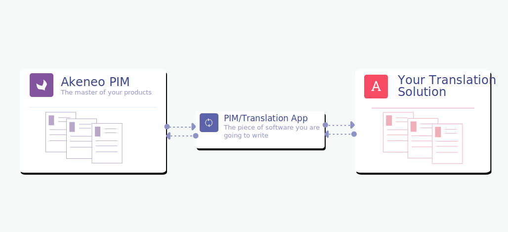

# How to build your connector?

## A connection compliant method

Now that you have a good overview of Akeneo PIM data, you are probably wondering how your online translation connector will interact with Julia while being compatible with all of our PIM editions.

The best way to do this is to develop a "[connection-compliant](https://help.akeneo.com/pim/serenity/articles/what-is-a-connection.html)" connector based on our API.

:::tips
Please don't hesitate to read our ["4 reasons why you should use our API"](https://api.akeneo.com/documentation/why-the-api.html#4-reasons-why-you-should-use-our-api) page!
:::

We suggest following our method which leans on some useful existing PIM features to interact with Julia.

This method is based on one of our Marketplace connector specifications: [GlobalLink Connect for Akeneo](https://marketplace.akeneo.com/extension/globallink-connect-akeneo) from the [Translations.com](https://www.translations.com) company.

## Some pre-requisites

First of all, we're going to ask Julia to do some work!  
Indeed, in order for your connector to interact with Julia, we will have to ask her to **check some pre-requisites** and to **add some additional data** in her PIM.

### Create a dedicated connection

First, in order to communicate with your connector and obtain API credentials, Julia needs to create a dedicated [connection](https://help.akeneo.com/pim/serenity/articles/manage-your-connections.html) for your connector.

To do so she will need to:
1. Go to the `System` menu and then, on the `Connections` submenu
2. Click on `Create`
3. In the `Label` field, enter the name of your connector.
4. Choose the `Other` flow type

Whenever you create a connection, the PIM automatically generates a set of credentials for you.

These API credentials consist of 4 items:
* the `client id`,
* the `secret`,
* the connection `username`,
* the connection `password`.

:::warning
Don't forget to set the [permissions](https://help.akeneo.com/pim/serenity/articles/manage-your-connections.html#set-the-permissions) of this connection!
:::

As you may understand, your connector needs to have a dedicated UI or a configuration file in order to manage these PIM API credentials.

### Check Julia's PIM data

Then, in order for your connector to be able to add translations, Julia's PIM must be correctly set up.

:::warning
That's why you must check with Julia that in her PIM:
* All locales required for translations have been activated.
* All attributes requiring translation for products or product models are set to "localizable".
:::

### Create a translation attribute group

First, in order not to confuse these new product attributes with some of her other product attributes, it is necessary for Julia to create **a specific attribute group** named `Translations`.

To create this attribute group:
1. Go to `Settings > Attribute groups`
2. Click on `CREATE` in the top-right corner
3. Add a new attribute group with the code and label: `Translations`.

### Create translation attributes

Then, Julia must create 6 new attributes in this attribute group:

* `Translation submission name`: This attribute allows Julia to set a name for her translation project. It'll also allow her to easily find the project in the interface of your online translation solution. Set up this attribute as followed:
  - Attribute type: text
  - Attribute code: `translationName`
  - Attribute label: `Translation submission name`
  - Attribute group: `Translations`
  - Usable in grid: enabled
* `Translation submitter`: This attribute allows Julia to associate her name with her translation project. Among its options, this simple select attribute should list all the possible contributor names. Set up this attribute as followed:
  - Attribute type: simple select  
  - Attribute code: `translationSubmitter`
  - Attribute label: `Translation submitter`
  - Attribute group: `Translations`
  - Usable in grid: enabled
* `Translation queued`: This attribute allows Julia to define if a product needs to be translated. Set up this attribute as followed:
  - Attribute type: Yes/No (Boolean)
  - Attribute code: `translationQueued`
  - Attribute label: `Translation queued`
  - Attribute group: `Translations`
  - Usable in grid: enabled
* `Translation locales`: This attribute allows Julia to choose one or more target locales for her translation project. This multi-select attribute should contain, in its `options`, all the possible destination locales Julia can use for her translation requests. These same `locales` must already exist in Akeneo PIM and in your online translation tool. Set up this attribute as followed:
  - Attribute type: multi-select
  - Attribute code: `translationLocales`
  - Attribute label: `Translation locales`
  - Attribute group: `Translations`
  - Usable in grid: enabled
* `Translation due date`: This attribute allows Julia to indicate when she would like her products to be translated. Set up this attribute as followed:
  - Attribute type: date
  - Attribute code: `translationDate`
  - Attribute label: `Translation due date`
  - Attribute group: `Translations`
  - Usable in grid: enabled  
* `Translation status`: This attribute allows your translator to give a status about the translation project to Julia. As this attribute has a `Read only` property, it can't be modified by Julia. This status can only be modified by your connector through the API and set the translation project status for each desired locale. This attribute contains these options:    
  |      Code      |     Label      |
  | :------------- | :------------- |
  | INPROGRESS     | In progress    |
  | TRANSLATED     | Translated     |
  | CANCELLED      | Cancelled      |
  Then, set up this attribute as followed:
  - Attribute type: simple select  
  - Attribute code: `translationStatus`
  - Attribute label: `Translation status`
  - Attribute group: `Translations`  
  - Value per locale: enabled (in order to have a status for each locale)    
  - Read only: enabled (can only be modified via API)   
  - Usable in grid: enabled
  
::: tips
To create an attribute:
1. Go to `Settings > Attributes`
2. Click on `CREATE ATTRIBUTE` in the top-right corner of the screen
:::

:::info
This list of attributes is not exhaustive and may need to be adapted depending on your online translation solution and the information required to perform a translation project.
:::

Once the `Translation` attribute group and its attributes have been created, Julia needs to assign the `Translations` attribute group to all existing families.

:::tips
Julia can do this by using this [bulk action](https://help.akeneo.com/pim/serenity/articles/product-mass-actions.html) process:
1. Go to `Settings > Families`
2. Select all families
3. Click on `BULK ACTIONS` at the bottom of the page
4. Select `Set attributes requirements` and then click on `NEXT`
5. Click on `ADD BY GROUPS` and `ADD` the `Translations` attribute group
6. Click on `CONFIRM`
:::

And that's it! Congratulations! 🎉  
Everything is now ready for Julia to receive the PIM products she wants to translate!

## Julia's translation process

As you have understood, Julia will use the previous PIM attributes to define which of her products are to be translated and how they will be processed.

Now let's see how Julia will work with these new PIM translation features.

### Select the attributes to be translated

First, Julia needs to select the product she wants to translate:
1. Go to the `Products` menu
2. Select the "source" locale
3. Select products (and/or product models) you want to translate

:::tips
For this product selection, Julia can help herself by using her PIM grid [filtering](https://help.akeneo.com/pim/serenity/articles/products-grid.html#use-filters) system or by creating a [specific view](https://help.akeneo.com/pim/serenity/articles/manage-your-views.html).
:::

### Perform a "bulk action"

Then, she needs to perform a [bulk action](https://help.akeneo.com/pim/serenity/articles/product-mass-actions.html) on these products.

For this action, Julia have to:
1. Click on the `BULK ACTIONS` button at the bottom of the page
2. Select `Edit attributes values` and click on `NEXT`
3. In the `SELECT ATTRIBUTES` dropdown, search and select these 5 translation attributes and click on `ADD`:
    * Translation submission name
    * Translation submitter
    * Translation queued
    * Translation locales
    * Translation due date
4. Now set the translation attributes:
    * `Translation name`: enter the desired name for the translation project,
   * `Translations submitter`: select her name,
    * `Translation queued`: enable the attribute by sliding the toggle button towards `Yes`,
    * `Translation locales`: select the desired target locales for translation,
    * `Translation due date`: Select the date on which you want to receive the translation.
5. Click on `NEXT` and `CONFIRM` to launch the bulk action.

After this last action, the bulk action will run and Julia will be notified in the Akeneo PIM notification bar once it is successfully executed.

With these new attributes, your connector is now ready to go!

### How it works with your connector?

At regular intervals, your connector will need to retrieve products where the `Translation queued` attribute has been set to enable (set to `true`).

You can do this by using our PIM [API filtering system](https://api.akeneo.com/documentation/filter.html#filter-on-product-values) on product attribute value.

Then your connector needs to set this attribute to `false` and change the `Translation status` attribute to `IN PROGRESS` to indicate to Julia that the translation is being processed by one of your translators.

:::tips
Using the ["get a list of products"](https://api.akeneo.com/api-reference.html#get_products) API endpoint (with the correct filter), your connector will retrieve a JSON structure of each localizable products.

Then with the help of the family code of these products, your connector will be able to call the ["get the list of attributes"](https://api.akeneo.com/api-reference.html#get_attributes) API endpoint to retrieve the type of each attributes that compose this product family.

By analyzing these types, you will be able to define for your translator which are the textual attributes he needs to translate.
:::

When the translation is finished, your translator needs to set the `Translation status` attribute to `TRANSLATED` and import all translated product data back in the PIM.

If for some reason the translation project has been canceled, your translator needs to set the `Translation status` attribute to `CANCELLED` and import this product data back into the PIM.

:::info
To develop theses connector actions, and to understand our API please follow our [wonderful dedicated API documentation](https://api.akeneo.com)!
:::

### Check the "Translation status"

Now let's go back to Julia's side and see how she can check her translation projects status.

As the `Translation status` has been declared as `Usable in grid`, Julia can:
* [Customise her grid](https://help.akeneo.com/pim/serenity/articles/products-grid.html#customise-the-grid) to add the `Translation status` attribute: this will allow her to sort her products according to their translation status.
* Add the `Translation status` attribute in her [grid filters](https://help.akeneo.com/pim/serenity/articles/products-grid.html#use-filters): this will allow her to filter only products with a specific translation status and create a dedicated [view](https://help.akeneo.com/pim/serenity/articles/manage-your-views.html#work-with-the-views) for this feature.

Of course, she can do the same for all the other "Translation" attributes.

As you can see, without any PIM customization and with a few developments on your connector, Julia can build some powerful translation features in her PIM!
