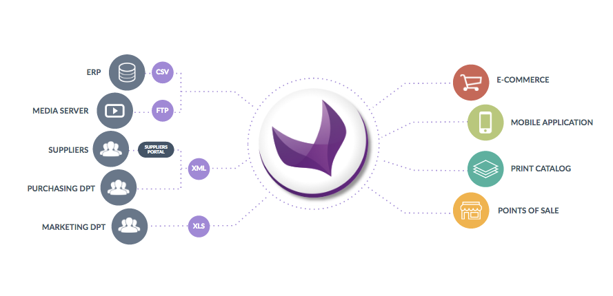

# Introduction

_You are probably asking yourself a ton of questions about the Akeneo API. Here are the answers. Go get them!_

## What is a PIM?

> Never heard of Julia? Let me tell you her story

Julia is working at Zaro, a very famous clothes retailer. She is a __marketer__, which means that she is responsible for all the products the brand is selling. Her everyday job is to ensure that anytime there are mentions of a Zaro product, the information about it is complete and clear. And there are mentions of Zaro products everywhere! On their ecommerce site, on their catalog, on their mobile application and even in their points of sale.

So that's a lot of __work__!

To make it a little bit more difficult, products information come from a great number of sources such as:
 - the ERP,
 - the media server on which the pictures of the products are stored,
 - the suppliers who know the precise characteristics of each product,
 - ...

It is almost __impossible__ for Julia to deal with all these sources.

So, to prevent Julia from going nuts, her company has invested in a very useful tool, a __PIM__. This type of software helps companies to centralize and harmonize all the technical and marketing information of their catalogs and products. That's exactly what __Julia needs__!

As summed up in the diagram below, a PIM allows Julia to gather all the product information in one single place, to enrich it and to spread it to several channels like an e-commerce website or a printed catalog... 


**In a nutshell, the PIM is for product information what CRM is for customer information!**

_Well, if you do not know what a CRM is, here is a little bit of [information](https://en.wikipedia.org/wiki/Customer_relationship_management). ;)_

::: panel-link Want more details about the Akeneo PIM solution? [Check our website!](http://www.akeneo.com)
:::

## Why did we create an API?

When you install a PIM for a client, you usually have to write tools or even connectors. These connectors are here to connect the PIM with all the data sources it needs. They are also developed to spread products information to systems such as e-commerce website or marketplaces.

The API is here to help you develop theses tools and connectors.

### Stable API = Long-lasting tools

Today, when you write a tool/connector, you have to dig deeply into the PIM code. So you ended up writing code that is really tied to ours. It can lead to painful migrations, especially when things have [changed in our codebase](https://github.com/akeneo/pim-community-dev/blob/master/CHANGELOG-1.7.md).

But we really want you to keep writing amazing tools, we had to do something to help you.

And here comes the API!

Thanks to the API, you will be able to build long lasting tools. We guarantee that this brand new API will be stable in time and that we will not integrate BC breaks between versions.

In the end, we hope that these amazing tools you are going to build on top of our API, will be easier to implement, easier to integrate, easier to maintain and above all, that you will not suffer from painful migrations again.

### More languages = more innovation

With the API, you will also be able to write tool in another language than PHP. So take your favorite technology and do not hesitate, write your tools with it.

As the API is a standard REST API, you can use the language you want to implement connectors or even external applications based on the PIM data.

Be innovative! Offer value to our common end-users! They will love it.


## From the old API to the new one

With the introduction of this new Web API in the 1.7 release, we decided to remove the old one which was not compatible. This means you won't be able to use it anymore.

But don't worry, if you were using it, we've got you covered. In the following section, you will find a guide explaining you the main differences between the two APIs. We really hope it will facilitate your migration process.

### Authentication

In the previous API, the authentication was made with [WSSE](https://en.wikipedia.org/wiki/WS-Security). This changes with the new API. We now use classical [`OAuth2`](https://oauth.net/2/).

As a result, you will no longer be able to generate an API key in your user settings, this key being now useless. The new authentication is now based on client ids and secret.

:::panel-link Everything about the new authentication [Take a look in here!](/documentation.html#authentication)
:::

### Response format

The old API was able to get you a product in a given format which was the following.

```json
{
  "family":"mug",
  "groups":[],
  "categories":["desktops"],
  "enabled":true,
  "associations":{
    "X_SELL":{
      "products":["sku-001","sku-002","sku-003","sku-004"],
      "groups":[]
    }
  },
  "values":{
    "sku":[
      {
        "locale":null,
        "scope":null,
        "value":"sku-000"
      }
    ],
    "color":[
      {
        "locale":"en_US",
        "scope":null,
        "value":["Red","Blue","Purple"]
      }
    ],
    "name":[
      {
        "locale":"en_US",
        "scope":null,
        "value":"Iusto ea sint."
      },
      {
        "locale":"fr_FR",
        "scope":null,
        "value":"Neque eveniet quasi accusantium."
      }
    ]
  },
  "resource":"http:\/\/pim-dev.local\/api\/rest\/products\/sku-000"
}
```

Now the standard format for the product will be the following.
```json
{
  "identifier":"sku-000",
  "family":"mug",
  "groups":[],
  "categories":["desktops"],
  "enabled":true,
  "associations":{
    "X_SELL":{
      "products":["sku-001","sku-002","sku-003","sku-004"],
      "groups":[]
    }
  },
  "values":{
    "color":[
      {
        "locale":"en_US",
        "scope":null,
        "data":["Red","Blue","Purple"]
      }
    ],
    "name":[
      {
        "locale":"en_US",
        "scope":null,
        "data":"Iusto ea sint."
      },
      {
        "locale":"fr_FR",
        "scope":null,
        "data":"Neque eveniet quasi accusantium."
      }
    ]
  },
  "created": "2017-03-03T16:59:22+01:00",
  "updated": "2017-03-03T16:59:23+01:00"
}
```

We played the 7 differences game for you and guess what! There are only 4! Here are the results:
 - the value of the unique identifier attribute is not a product value anymore but it is exposed as the `identifier` property and it is now used as a primary key for the product,
 - each data stored in the product value is not stored under the `value` key anymore, but under the `data` key,
 - the `resource` property does not exist anymore,
 - there are two new properties: `created` and `updated` that gives you respectively the date of the creation of the product and the date of its last update.

:::panel-link Product standard format in details [You want to get more information about the new standard format regarding the product, don't hesitate to take a look to the dedicated documentation!](/documentation.html#product)
:::
