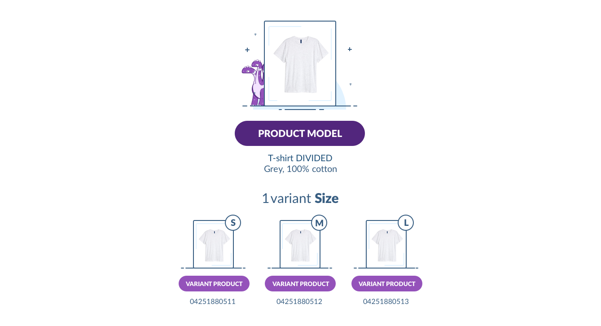

# Where is the `variant_group` field in my products?

If you landed here, it's surely because you noticed that you cannot use the `variant_group` field in the product anymore and you are wondering why.

Let me explain you the reason behind this change.

## A little bit of history

With the 1.7 version of the PIM, we decided to introduced the first step toward a great REST API by releasing a set of endpoints for the most used entities inside the PIM, such as the products and the families for example.

At this time, we already knew that we were going to make a big change in the way we manage the product with variants. So we knew that the notion of **variant groups might disappear**. That's why we decided to avoid developing the endpoints for this entity.

But... Mistakes happen. And unfortunately, we forgot about the `variant_group` field that was inside the product format. :( 

## The remodeling of the products with variants

Handling the products with variants inside the PIM was, at that time, very **painful**. Our users could use the variant groups to gather similar products so as to enrich more easily their commun information.

But they were **not user-friendly** because they could not appear directly in the product grid. You could not structure your variant groups thanks to families and there were no bulk actions or categorization of them.

To tackle this "products with variants" problematic, we also provided an extension called **"Inner Variation Bundle"**. But its settings were pretty **complex**. And the fact that it was delivered in a separate bundle was really weird since this subject is at the really heart of the modeling of your products catalog.

As you can see, the answers we gave at this time were not ideal.
So we decided to do something about it. We have so many users that encounter such problematic that we had to react.

As a result, we totally refounded the way we model the product with variants. In the 2.0 version of the PIM, it's now **easier** for our end-users to handle such products. This is a **real time saver**. They can see their variant products inside the grid, make smart search on them, they are also able to enrich the variant products almost like they were standard product.

# So what's changed?

The JSON standard format of a variant product is, in 2.0, the following:
```json
{
  "identifier": "1111111195",
  "family": "clothing",
  "parent": "jack_brown",
  "categories": [
    "tshirts"
  ],
  "enabled": true,
  "values": {
    "ean": [
      {
        "locale": null,
        "scope": null,
        "data": "1234567890207"
      }
    ],
    "size": [
      {
        "locale": null,
        "scope": null,
        "data": "s"
      }
    ],
    "weight": [
      {
        "locale": null,
        "scope": null,
        "data": {
          "amount": "800.0000",
          "unit": "GRAM"
        }
      }
    ],
    "color": [
      {
        "locale": null,
        "scope": null,
        "data": "brown"
      }
    ],
    "name": [
      {
        "locale": null,
        "scope": null,
        "data": "jack"
      }
    ],
    "erp_name": [
      {
        "locale": "en_US",
        "scope": null,
        "data": "Jack"
      }
    ],
    "collection": [
      {
        "locale": null,
        "scope": null,
        "data": [
          "summer_2017"
        ]
      }
    ]
  },
  "associations": {},
  "quantified_associations": {},
  "created": "2017-10-05T11:25:48+02:00",
  "updated": "2017-10-05T11:25:48+02:00"
}
```

As you can see, in the example above, there is no `variant_group` field anymore. So, how to migrate to 2.0, you will ask.

It depends on your products catalog structure for these products with variants.

## My variant groups are very structured

You used the variant groups in a very effective way and they are really structured:
 - You have less than 5 axes in your variant group,
 - The products inside your variant group use the same family,
 - The products inside your variant group use the same attributes.

It's very good news for you! The solution is to use the new [product model](/concepts/products.html#product-model) and [family variant](/concepts/catalog-structure.html#family-variant) entities, that were introduced in the remodeling of the products with variants for the 2.0.

### A few words about the new modeling

First, let me explain how this new modeling works.

In 2.0, you now can have families that have variants. These variants are called `family variant` and they are used to distribute the family attributes in the different levels of enrichment of your family.

In your case, you will create a family variant with two levels of enrichment, which means you will have one level of variant. You can then choose in the other attributes of the family, which one will be your common attributes and which one will differ depending of the variant products.

The common attributes of your product will be stored in a new entity called `product model`. It's an entity which is really similar to classical products as its aim is to be the receptacle of the common attribute values of your variant products.

All the other attributes have their value stored into standard products that we call `variant product`.

To be much clearer, below is a diagram representing this modeling.



### Example  
In the REST API, you will end up with the following change in your products with variants.   
Before in 1.7
```json
{
  "identifier": "1111111195",
  "family": "clothing",
  "groups": [],
  "variant_group": "my_structured_variant_group",
  "categories": [ "tshirts"],
  "enabled": true,
  "values": {},
  "created": "2017-10-05T11:25:48+02:00",
  "updated": "2017-10-05T11:25:48+02:00"
}
```
Now in 2.0
```json
{
  "identifier": "1111111195",
  "family": "clothing",
  "groups": [],
  "parent": "my_product_model",
  "categories": ["tshirts"],
  "enabled": true,
  "values": {},
  "created": "2017-10-05T11:25:48+02:00",
  "updated": "2017-10-05T11:25:48+02:00"
}
```

::: info
For this solution to work, do not forget to create a product model with the code `my_product_model`. The family `clothing` used here, should have a family variants that is linked to this product model. ;)
:::

## My variant groups are a real mess

Your variant groups are not structured enough:
 - You have more than 5 axes in your variant group,
 - The products inside your variant group do not use the same family,
 - The products inside your variant group do not use the same attributes.

You will only have one choice here: think about a better modeling for these products.

Can I add a family to them? Can I reduce the number or variant axes? If you find an answer to these questions, you will be able to use the first method explain above in the ["My variant group are very structured"](#my-variant-groups-are-very-structured) section.

