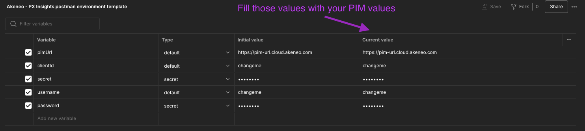

# Getting Started

This guide provides a step-by-step walkthrough to help you send your reviews using the PX Insights API.
By the end, you’ll have successfully authenticated and triggered the synchronization of your reviews.

## Prerequisites

Before proceeding, make sure you have an active <a href="https://api.akeneo.com/apps/overview.html#whats-an-akeneo-app" target="_blank">App</a> (either a <a href="https://api.akeneo.com/apps/create-custom-app.html" target="_blank">Custom App</a> or a standard <a href="https://api.akeneo.com/getting-started/connect-the-pim-4x/step-1.html#you-said-connection" target="_blank">Connection</a>) to an Akeneo PIM.

To learn how to create a connection, refer to the <a href="https://api.akeneo.com/documentation/authentication.html#client-idsecret-generation" target="_blank">Authentication Guide</a>.
If you're setting up a custom App, follow <a href="https://api.akeneo.com/tutorials/how-to-get-your-app-token.html" target="_blank">this tutorial</a> to obtain an App token.

---

## Using Postman

The easiest way to explore the PX Insights API is via our Postman Collection.

### 1. Import the Postman Collection

1. Download the <a href="https://storage.googleapis.com/akecld-prd-cipr-prd-api-assets/generated_postman_collection.json" target="_blank">Postman Collection</a>
2. Download the <a href="https://storage.googleapis.com/akecld-prd-cipr-prd-api-assets/postman_environment_template.json" target="_blank">Postman environment template</a>
3. Import both files into Postman (see <a href="https://learning.postman.com/docs/getting-started/importing-and-exporting/importing-data/" target="_blank">this guide</a> if needed)

### 2. Configure the environment

The collection includes a built-in script to handle authentication when using a PIM connection.

Fill in the environment variables with your PIM connection credentials — if valid, the script will automatically generate an `access_token`.



### 3. Trigger the synchronization of your reviews

1. Select your Postman environment
2. Use the `Ingest reviews data asynchronously` request
3. Paste your review payload and send it

---

## Using Curl

### 1. Set up authentication

This example uses a PIM `connection` to authenticate and retrieve an API token.


**Set environment variables:**
```bash
export CLIENT_ID="your-client-id"
export CLIENT_SECRET="your-client-secret"
export API_USERNAME="your-API-username"
export API_PASSWORD="your-API-password"
export TARGET_PIM_URL="https://your-pim.cloud.akeneo.com"
```

Replace the placeholders with your actual credentials and host URL.

**Encode the Client ID and Secret in base64 format, separated by a colon `:`:**
```bash [snippet:Shell]
export BASE64_ENCODED_CLIENTID_AND_SECRET=$(echo -n "$CLIENT_ID:$CLIENT_SECRET" | base64 -w 0)
# For Mac users, remove the -w 0 option
```

**Get your API token:**
```bash [snippet:Shell]
 curl --request POST "$TARGET_PIM_URL/api/oauth/v1/token" \
  --header "Content-Type: application/json" \
  --header "Authorization: Basic $BASE64_ENCODED_CLIENTID_AND_SECRET" \
  --data-raw '{
    "grant_type": "password",
    "username": "'"$API_USERNAME"'",
    "password": "'"$API_PASSWORD"'"
  }'
```

**Store the access_token from the response:**
```bash [snippet:Shell]
export PIM_API_TOKEN="..." # Replace with the actual token
```

::: info
ℹ️ Tokens are valid for one hour.
:::

::: info
🛠 You may also use a custom App. As long as you have a valid `client_id` and API token, you're good to go.
:::

### 2. Trigger the synchronization of your reviews

From here, we'll use the PX Insights REST API at: https://px-insights.app.akeneo.cloud/api/v1

::: info
🛠 For all requests to the PX Insights API, you must include these headers: `X-PIM-URL`, `X-PIM-TOKEN`, and `X-PIM-CLIENT-ID`.
:::

**Asynchronous mode (recommended)**

This is the standard production-safe endpoint:
```bash [snippet:Shell]
curl --request POST 'https://px-insights.app.akeneo.cloud/api/v1/reviews/ingest/async' \
 --header "X-PIM-URL: $TARGET_PIM_URL" \
 --header "X-PIM-TOKEN: $PIM_API_TOKEN" \
 --header "X-PIM-CLIENT-ID: $CLIENT_ID" \
 --header 'Content-Type: application/json' \
 --data-raw '{
  "product_identification": {
    "origin": "Yotpo",
    "metadata": {
      "sku": "product-123"
    }
  },
  "raw_reviews": [
    {
      "external_id": "review-001",
      "score": 5,
      "title": "Excellent product!",
      "text": "This product exceeded my expectations. The quality is outstanding and it works perfectly."
    },
    {
      "external_id": "review-002",
      "score": 3,
      "title": "Good but could be better",
      "text": "The product is good overall, but I had some issues with the packaging."
    }
  ]
}'
```

**Synchronous mode (development only)**

For troubleshooting and debugging during development, you can use the **synchronous** endpoint:
```bash [snippet:Shell]
curl --request POST 'https://px-insights.app.akeneo.cloud/api/v1/reviews/ingest/' \
 --header "X-PIM-URL: $TARGET_PIM_URL" \
 --header "X-PIM-TOKEN: $PIM_API_TOKEN" \
 --header "X-PIM-CLIENT-ID: $CLIENT_ID" \
 --header 'Content-Type: application/json' \
 --data-raw '{ ... }'
```

::: warning
This endpoint processes reviews immediately and returns processing results in the response.
⚠️ It is not intended for production use. Rate limits are much stricter, and it should only be used for debugging.
:::

**Request Body Parameters:**

| Parameter                             | Type   | Description                                                               |
|--------------------------------------|--------|----------------------------------------------------------------------------|
| `product_identification`             | object | Information to identify the product associated with the reviews            |
| `product_identification.origin`      | string | Source identifier for the reviews (e.g., Yotpo, Amazon, your own website)  |
| `product_identification.metadata`    | object | Additional information to identify the product                             |
| `product_identification.metadata.sku`| string | Product SKU that these reviews are associated with                         |
| `raw_reviews`                        | array  | Collection of review objects to be ingested                                |
| `raw_reviews[].external_id`          | string | Unique identifier for the review in your system                            |
| `raw_reviews[].score`                | number | Rating score for the review (1–5)                                          |
| `raw_reviews[].title`                | string | Review title or headline                                                   |
| `raw_reviews[].text`                 | string | The full review content                                                    |

**Response:**

Upon successful submission, the API will acknowledge receipt of your reviews for asynchronous processing.

```json [snippet:Response]
{
  "message": "Reviews received for processing"
}
```

**Possible Error Responses:**

- `400 Bad Request`: Invalid request format or missing required fields
- `401 Unauthorized`: Invalid authentication credentials
- `403 Forbidden`: Not authorized to perform this action
- `500 Internal Server Error`: Server-side error, retry recommended

::: panel-link Let's see the API reference! [Next](/px-insights/key-platform-behaviors.html)
:::
