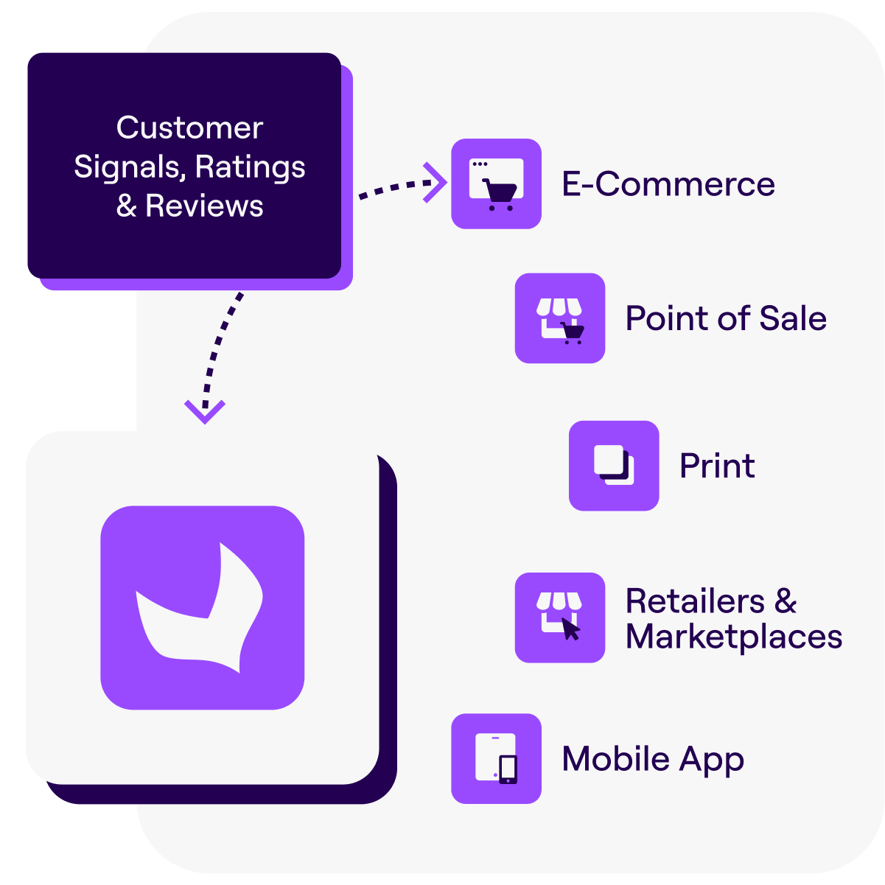

# PX Insights Overview

**PX Insights** is a premium add-on module designed to capture customer feedback and behavioral signals across shopping experiences. It transforms this data into actionable insights, helping businesses enrich their product records, optimize merchandising strategies, boost conversions, and reduce product returns.

::: warning
**Paid Add-on Subscription Required**

PX Insights requires an active paid subscription.
Although the API will technically accept review data without an active subscription, these reviews **will not be displayed** in your PIM interface.

To ensure visibility of your data and avoid any disruption, please contact your Akeneo representative to activate your PX Insights subscription **before integrating the API**.
:::

::: panel-link Getting Started [Next](/px-insights/getting-started.html)
:::
