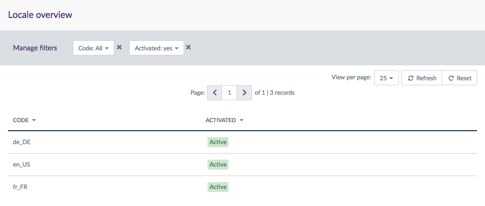
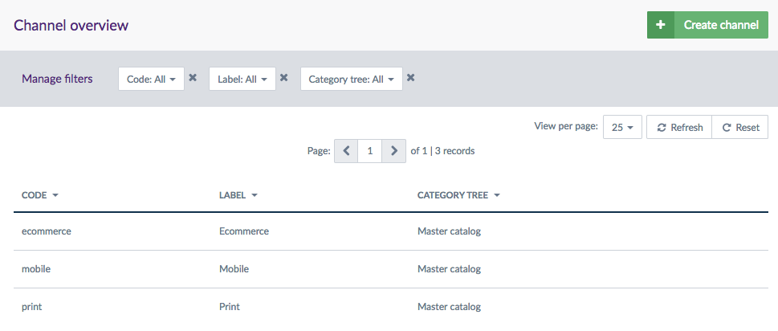
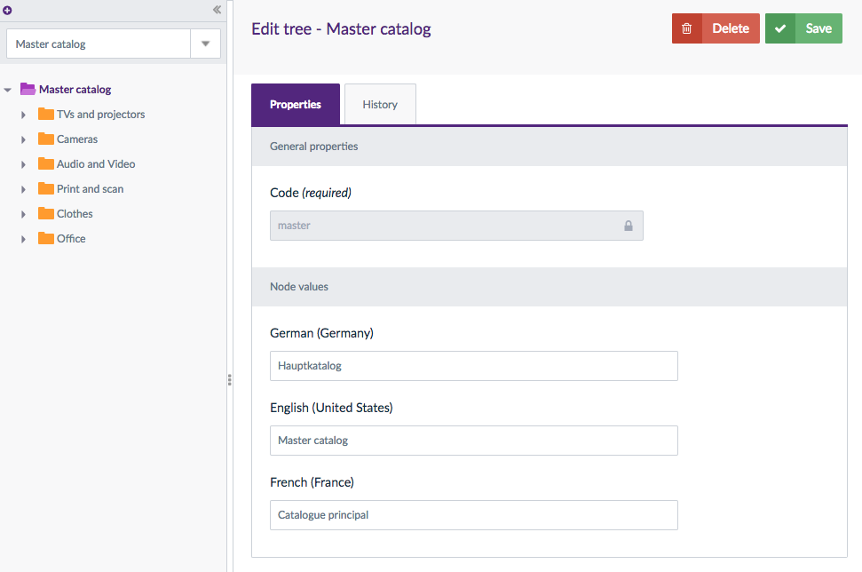
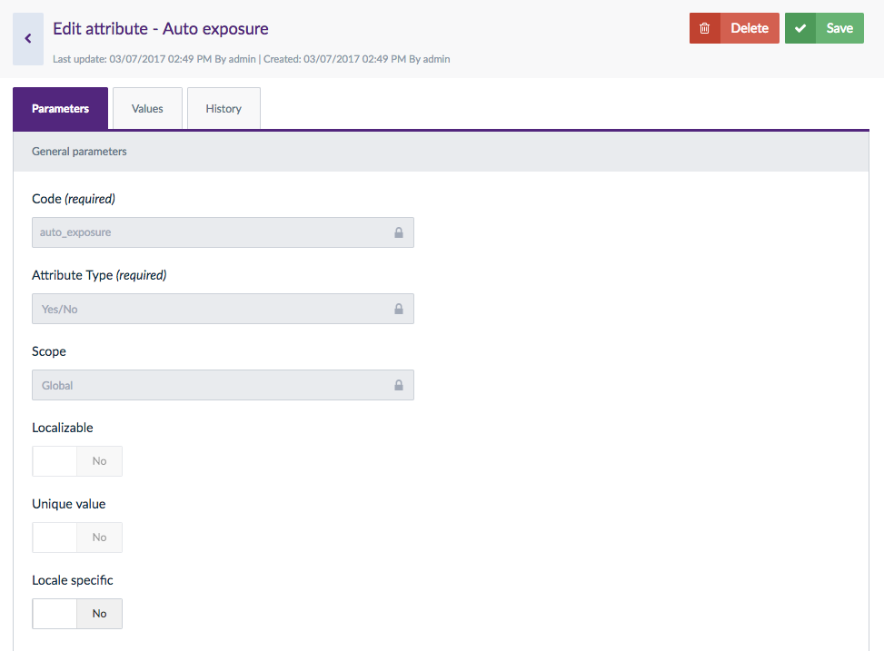
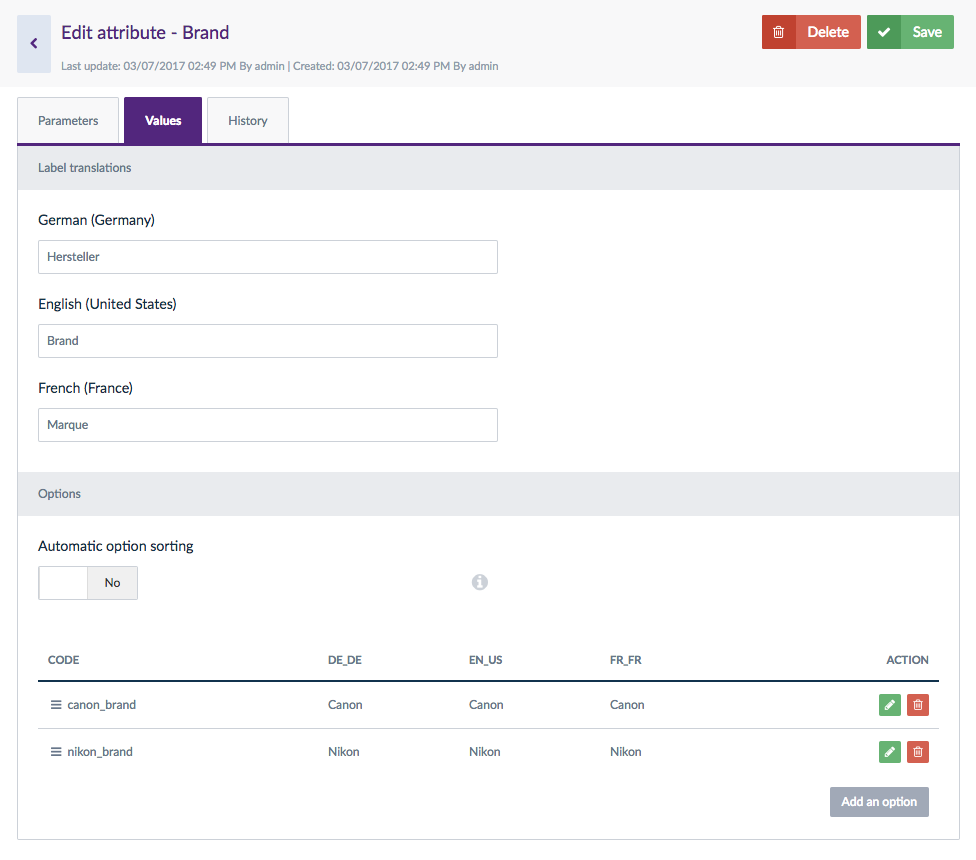
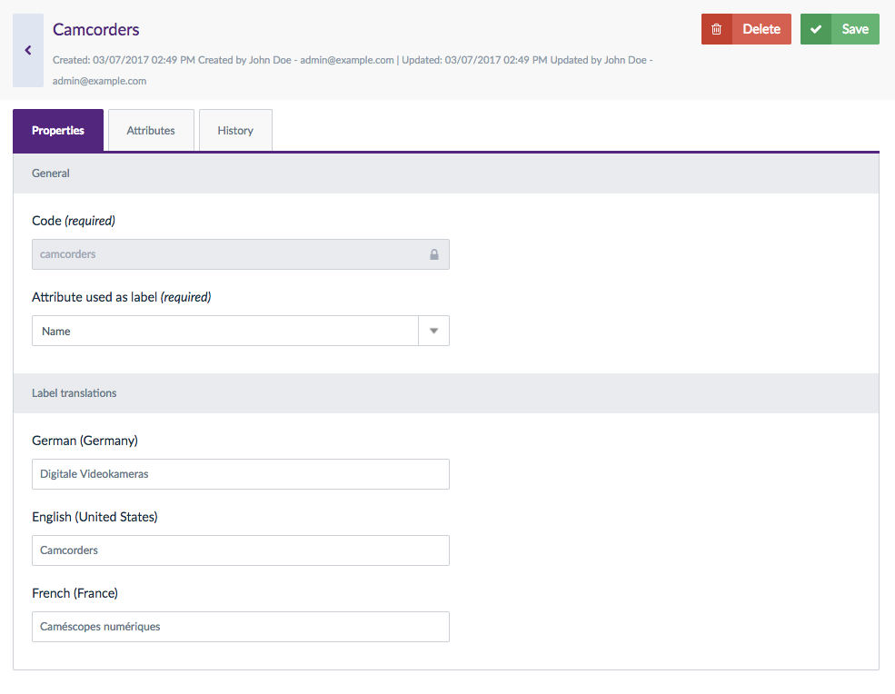
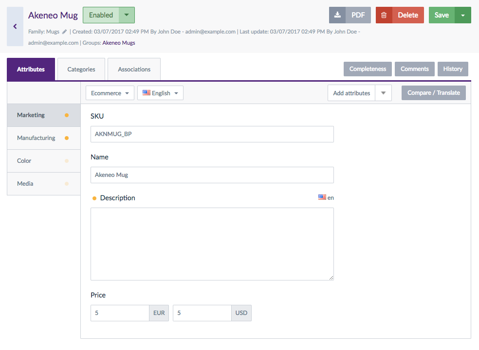

# Resources

_A small presentation of each entity accessible through the API and their associated standard format_

For each resources, we defined a JSON standard format which is used to retrieve, create and update data in the PIM.

## Locale
A locale is a combination of a language (English, German, French...) and a country (United States, United Kingdom, France...). Examples: English UK (en_GB), English US (en_US), English AU (en_AU).

You can have one or more locales activated in your PIM.

In the Akeneo UI, you can find the locales in the `Settings`/`Locales` menu.



Below is the JSON standard format representing this set of locales.

```json
{
  "code":"en_US",
  "enable":true
}
```
```json
{
  "code":"de_DE",
  "enable": true
}
```
```json
{
  "code":"fr_FR",
  "enable": true
}
```

::: panel-link Want more details about the locale resource? [Check its endpoint here!](/api-reference.html#get_locales)
:::

## Channel
An channel refers to a place where your product information will be visible: for example, a website, a print catalog or a mobile application.
Actually, a channel defines a selection of products and information to export.

:::info
A channel is also known as a «scope» in the Akeneo PIM.
:::

In the Akeneo UI, you can find them in the `Settings`/`Channels` menu.



Below is the JSON standard format representing this set of channels when requested through the API.

```json
{
  "code":"ecommerce",
  "currencies": [
    "USD",
    "EUR"
  ],
  "locales": [
    "de_DE",
    "en_US",
    "fr_FR"
  ],
  "category_tree": "master",
  "conversion_units": [],
  "labels":{
       "en_US":"Ecommerce",
       "de_DE":"Ecommerce",
       "fr_FR":"E-commerce"
   }
}
```
```json
{
  "code":"mobile",
  "currencies": [
    "USD",
    "EUR"
  ],
  "locales": [
    "de_DE",
    "en_US",
    "fr_FR"
  ],
  "category_tree": "master",
  "conversion_units": [],
  "labels":{
       "en_US":"Mobile",
       "de_DE":"Mobil",
       "fr_FR":"Mobile"
   }
}
```
```json
{
  "code":"print",
  "currencies": [
    "USD",
    "EUR"
  ],
  "locales": [
    "de_DE",
    "en_US",
    "fr_FR"
  ],
  "category_tree": "master",
  "conversion_units": [],
  "labels":{
       "en_US":"Print",
       "de_DE":"Drucken",
       "fr_FR":"Impression"
   }
}
```

::: panel-link Want more details about the channel resource? [Check its endpoint here!](/api-reference.html#get_channels)
:::

## Category

A category is a way of classifying products. Categories constitute category trees and in Akeneo, you can have multiple category trees with an unlimited number of levels (categories, subcategories, subsubcategories..).

:::info
A product can be classified in one or n categories.
:::

In the Akeneo UI, you can find the categories in the `Enrich`/`Categories` menu.



Below is the JSON standard format representing a set of categories.

```json
// A root category
{
  "code":"master",
  "labels":{
    "en_US": "Master catalog",
    "de_DE": "Hauptkatalog",
    "fr_FR": "Catalogue principal"
   },
  "parent":null
}
```
```json
// A subcategory
{
  "code":"tvs_projectors",
  "labels":{
    "en_US": "TVs and projectors",
    "de_DE": "TVs und projectoren",
    "fr_FR": "Téléviseurs et projecteurs"
   },
  "parent":"master"
}
```

::: panel-link Want more details about the category resource? [Check its endpoints here!](/api-reference.html#Categories)
:::

## Attribute

An attribute is a characteristic of a product. Each product is composed of a variety of attributes.

Depending on your Akeneo Edition version, you can have up to 13 attribute types: text and text area, simple or multiselect, boolean (yes/no), date, image, price, number, metric, assets (digital resources like a video, picture, PDF file...).

An attribute can be localizable. It means that it can have different values for each locale. This allows you to manage translations of your products according to the activated PIM locales. For instance, a localizable attribute will enable you to have one article name for each locale activated in your PIM. It is mostly used for text or (simple or multi) select attributes.

Some attributes can be shown only for specific locales. We will call them locale specific. For instance, a cold resistance attribute only for Russia, a Canadian tax only for Canada.

Finally, an attribute can be scopable. An attribute is scopable if its values differ for each channel. For instance, you might have one short description for your e-commerce website, maybe one even shorter for your mobile app but a long one for your print catalog.

:::warning
An attribute cannot be both localizable and locale specific at the same time.
:::

In the Akeneo UI, you can find the attributes in the `Settings`/`Attributes` menu. Below is an example of one attribute in the UI.



Below is the JSON standard format representing this attribute.

```json
{
  "code": "auto_exposure",
  "type": "pim_catalog_boolean",
  "group": "technical",
  "localizable": false,
  "scopable": false,
  "labels": {
    "de_DE": "Auto exposure",
    "en_US": "Auto exposure",
    "fr_FR": "Auto exposure"
  },
  "unique": false,
  "useable_as_grid_filter": true,
  "allowed_extensions": null,
  "metric_family": null,
  "default_metric_unit": null,
  "reference_data_name": null,
  "available_locales": null,
  "max_characters": null,
  "validation_rule": null,
  "validation_regexp": null,
  "wysiwyg_enabled": null,
  "number_min": null,
  "number_max": null,
  "decimals_allowed": null,
  "negative_allowed": null,
  "date_min": null,
  "date_max": null,
  "max_file_size": null,
  "minimum_input_length": null,
  "sort_order": 39
}
```

::: panel-link Want more details about the attribute resource? [Check its endpoints here!](/api-reference.html#Attributes)
:::

## Attribute option

Some type of attributes offers list of choices. These available choices are attribute options.

Only attribute of type simple select, multiselect, reference data simple select and reference data multiselect can have options.

In the Akeneo UI, you can find the attribute options in the `Settings`/`Attributes` menu, then select a simple or multiselect attribute and go to the `Values` tab in the attribute form. Below is an example of the attribute options of the attribute `camera_brand` in the UI.



Below is the JSON standard format representing theses attribute options.

```json
{
  "code": "canon_brand",
  "attribute": "camera_brand",
  "sort_order": 1,
  "labels": {
    "de_DE": "Canon",
    "en_US": "Canon",
    "fr_FR": "Canon"
  }
}
```
```json
{
  "code": "nikon_brand",
  "attribute": "camera_brand",
  "sort_order": 1,
  "labels": {
    "de_DE": "Nikon",
    "en_US": "Nikon",
    "fr_FR": "Nikon"
  }
}
```

::: panel-link Want more details about the attribute option resource? [Check its endpoints here!](/api-reference.html#Attribute options)
:::

## Media file
A media file can be an image (a photo, an illustration, etc.), a video (demonstration of a product, an animation, etc.), an audio file (music, podcast, etc.), other multimedia (PDF file) or office documents (.xlsx, .docx, .csv, etc.). It can also be any exotic format you could use.

It is used as the attribute value of a product, i.e. a product value.

In the Akeneo UI, you can find media files in the product form when they are associated to a media attribute.

Below is the JSON standard format representing a media file.

```json
{
  "code": "1/d/7/f/1d7f0987000cea4d14908fe679af4e36ea3632ef_10806799_1356.jpg",
  "original_filename": "10806799-1356.jpg",
  "mime_type": "image/jpeg",
  "size": 16070,
  "extension": "jpg",
  "_links": {
    "download": {
      "href": "http://test-dev-feature-10.akeneo.com/api/rest/v1/media-files/1/d/7/f/1d7f0987000cea4d14908fe679af4e36ea3632ef_10806799_1356.jpg/download"
    }
  }
}
```

::: panel-link Want more details about the media file resource? [Check its endpoints here!](/api-reference.html#Media_files)
:::

## Family

A family is a set of attributes that are shared by products belonging to this family. In other words, a family can be considered as a template for products. A product family can use all of the attributes available in the PIM. Several families of products can use the same attributes. 

When a product is associated to a family, the product automatically inherits from all attributes defined at the family level. 

The family helps managing the product’s completeness as you can say at the family level, which family attributes are required for the completeness calculation.

::: info
A product can belong to only one family.

Nevertheless, a product does not have to belong to a family. In this case, it has no default attributes.
:::

In the Akeneo UI, you can find the families in the `Settings`/`Families` menu. Below is an example of a family in the UI.



Below is the JSON standard format representing this family.

```json
{
  "code": "camcorders",
  "attributes": [
    "description",
    "image_stabilizer",
    "name",
    "optical_zoom",
    "picture",
    "power_requirements",
    "price",
    "release_date",
    "sensor_type",
    "sku",
    "total_megapixels",
    "weight"
  ],
  "attribute_as_label": "name",
  "attribute_requirements": {
    "ecommerce": [
      "description",
      "name",
      "price",
      "sensor_type",
      "sku",
      "total_megapixels"
    ],
    "mobile": [
      "description",
      "name",
      "price",
      "sensor_type",
      "sku",
      "total_megapixels"
    ],
    "print": [
      "description",
      "name",
      "price",
      "sensor_type",
      "sku",
      "total_megapixels"
    ]
  },
  "labels": {
    "en_US": "Camcorders",
    "fr_FR": "Caméscopes numériques",
    "de_DE": "Digitale Videokameras"
  }
}
```

::: panel-link Want more details about the family resource? [Check its endpoints here!](/api-reference.html#Families)
:::

## Product

The product is the central entity of the PIM. This is the entity that holds all the information concerning products.

It can be classified in several categories. It can belong to a group and inherit its attributes from a family. It can hold associations with other products or group of products.

In other words, this really is the heart entity of the PIM.

In the Akeneo UI, you can find the products in the `Enrich`/`Products` menu. Below is an example of a product in the UI.



Below is the JSON standard format representing a product.

```json
{
  "identifier": "AKNMUG_BP",
  "family": "mugs",
  "groups": [],
  "variant_group": "akeneo_mug",
  "categories": [
    "goodies"
  ],
  "enabled": true,
  "values": {
    "description": [
      {
        "locale": "de_DE",
        "scope": "mobile",
        "data": "Akeneo Mug"
      },
      {
        "locale": "de_DE",
        "scope": "print",
        "data": "Akeneo Mug"
      },
      {
        "locale": "en_US",
        "scope": "mobile",
        "data": "Akeneo Mug"
      },
      {
        "locale": "en_US",
        "scope": "print",
        "data": "Akeneo Mug"
      },
      {
        "locale": "fr_FR",
        "scope": "mobile",
        "data": "Mug Akeneo"
      },
      {
        "locale": "fr_FR",
        "scope": "print",
        "data": "Mug Akeneo"
      }
    ],
    "main_color": [
      {
        "locale": null,
        "scope": null,
        "data": "black"
      }
    ],
    "name": [
      {
        "locale": null,
        "scope": null,
        "data": "Akeneo Mug"
      }
    ],
    "secondary_color": [
      {
        "locale": null,
        "scope": null,
        "data": "purple"
      }
    ],
    "price": [
      {
        "locale": null,
        "scope": null,
        "data": [
          {
            "amount": "5.00",
            "currency": "EUR"
          },
          {
            "amount": "5.00",
            "currency": "USD"
          }
        ]
      }
    ]
  },
  "created": "2017-03-03T16:58:44+01:00",
  "updated": "2017-03-03T16:58:45+01:00",
  "associations": {
    "SUBSTITUTION": {
      "groups": [],
      "products": [
        "AKNMUG_WP",
        "AKNMUG_PB",
        "AKNMUG_PW"
      ]
    }
  }
}
```

::: panel-link Want more details about the product resource? [Check its endpoints here!](/api-reference.html#Products)
:::

### Product values

Product values hold all the information of the product. In concrete terms, it is the values of the product attributes.

In the API, the product values are in the property `values` of the product entity.

A product value follows this format:
```json
{
  "values": {
    ATTRIBUTE_CODE: [
      {
        "locale": LOCALE_CODE,
        "scope": CHANNEL_CODE,
        "data": DATA_INFORMATION
      }
    ]
  }
}
```
In this formula:
 - `ATTRIBUTE_CODE` is the code of an attribute of the product,
 - `LOCALE_CODE` is the code of a locale when the attribute is localizable,
 - `CHANNEL_CODE` is the code of a channel when the attribute is scopable,
 - `DATA_INFORMATION` is the value stored for this attribute for this locale (if attribute is localizable) and this channel (if the attribute is scopable). Its type and format depends on the attribute type.

#### Examples

**Product values of a localizable attribute**

The `short_description` attribute is scopable but not localizable, so it can hold several data values, up to one for each locale.
```json
{
  "short_description": [
    {
      "locale": "en_US",
      "scope": null,
      "data": "Tshirt long sleeves"
    },
    {
      "locale": "fr_FR",
      "scope": null,
      "data": "Tshirt manches longues"
    }
  ]
}
```
:::info
Note that the `scope` property is set to `null` in this case.
:::

**Product values of a scopable attribute**

The `release_date` attribute is neither scopable nor localizable, so it can hold several data values, up to one for each channel.
```json
{
  "release_date": [
    {
      "locale": null,
      "scope": "ecommerce",
      "data": "2012-03-13T00:00:00+01:00"
    },
    {
      "locale": null,
      "scope": "mobile",
      "data": "2012-04-23T00:00:00+01:00"
    }
  ]
}
```
:::info
Note that the `locale` property is set to `null` in this case.
:::

**Product values of a localizable and scopable attribute**

The `description` attribute is both scopable and localizable, so it can hold several data values, up to one for each couple of channels and locales.
```js
{
  "description": [
    {
      "locale": "de_DE",
      "scope": "mobile",
      "data": "Akeneo Mug"
    },
    {
      "locale": "de_DE",
      "scope": "print",
      "data": "Akeneo Mug"
    },
    {
      "locale": "en_US",
      "scope": "mobile",
      "data": "Akeneo Mug"
    },
    {
      "locale": "en_US",
      "scope": "print",
      "data": "Akeneo Mug"
    },
    {
      "locale": "fr_FR",
      "scope": "mobile",
      "data": "Mug Akeneo"
    },
    {
      "locale": "fr_FR",
      "scope": "print",
      "data": "Mug Akeneo"
    }
  ]
}
```

**Product value of a non localizable, non scopable attribute**

The `main_color` attribute is neither scopable nor localizable, so it can hold only one data value.
```json
{
  "main_color": [
    {
      "locale": null,
      "scope": null,
      "data": "black"
    }
  ]
}
```
:::info
Note that the `locale` and `scope` properties are all set to `null` in this case.
:::

::: panel-link Want to update product values? [Here you go!](/documentation.html#patch-product-values)
:::
