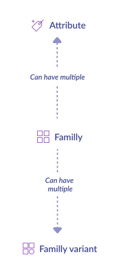
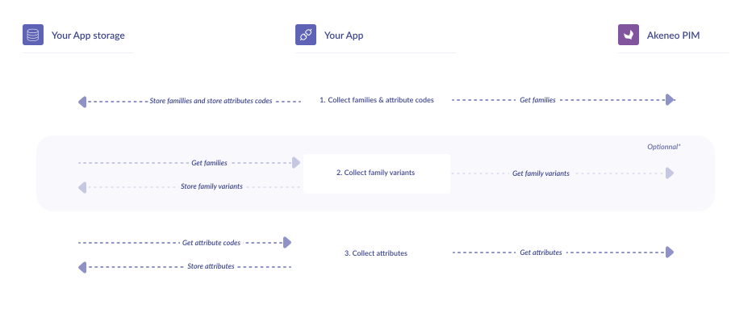

<a href="/tutorials/homepage.html" class="back-button">
   <button>
      
      All guided tutorials
   </button>
</a>

# How to get families, family variants, and attributes

<table class="tag-container">
    <tr>
        <td>Use case:</td>
        <td>
            <div class="tag-not-selectable">
                <div class="tag-color tag-color-light-blue"></div>
                <div class="tag-label">App Workflow</div>
            </div>
        </td>
    </tr>
    <tr>
        <td>PIM Features:</td>
        <td class="td-features">
            <div class="tag-not-selectable">
                <div class="tag-color tag-color-orange"></div>
                <div class="tag-label">Attributes</div>
            </div>
            <div class="tag-not-selectable">
                <div class="tag-color tag-color-pink"></div>
                <div class="tag-label">Families</div>
            </div>
        </td>
    </tr>
</table>

<div class="endpoint-container">
    <div class="endpoint-text">REST API endpoint(s):</div>
    <a href="/api-reference.html#get_families" class="endpoint-link" target="_blank" rel="noopener noreferrer">family</a>
    <a href="/api-reference.html#Familyvariants" class="endpoint-link" target="_blank" rel="noopener noreferrer">family variants</a>
    <a href="/api-reference.html#Attribute" class="endpoint-link" target="_blank" rel="noopener noreferrer">attributes</a>
</div>

<div class="block-requirements">
    <div class="block-requirements-headline">
        If you're starting to build your App, make sure you previously followed:
    </div>
    <div class="block-requirements-row">
        
        <div class="block-requirements-steps">
            <ul>
                <li>Step 1. <a href="how-to-get-your-app-token.html" target="_blank" rel="noopener noreferrer">Get your App token tutorial</a></li>
                <li>Step 2. <a href="how-to-retrieve-pim-structure.html" target="_blank" rel="noopener noreferrer">How to retrieve PIM structure</a></li>
            </ul>
        </div>
    </div>
</div>

## Context

Families and attributes are the basis of an Akeneo catalog structure: get them before retrieving the products from the PIM.

::: info
If you plan to get product variants and their corresponding models, we advise you to retrieve now the associated family variants.
:::



::: tips
Get the big picture <a href="/getting-started/synchronize-pim-products-6x/step-0.html" target="_blank" rel="noopener noreferrer">here</a>.
:::

## Fetch the catalog structure: families and attributes

### Workflow



### 0 - Initialization

```php [activate:PHP]

$pimUrl = 'https://url-of-your-pim.com';
$appToken = 'your_app_token'; // Token provided during oAuth steps

// If you haven't done it yet, please follow the Guzzle official documentation for installing the client 
// https://docs.guzzlephp.org/en/stable/overview.html#installation

// Set your client for querying Akeneo API as follows
$client = new \GuzzleHttp\Client([
    'base_uri' => $pimUrl,
    'headers' => ['Authorization' => 'Bearer ' . $appToken],
]);
```

### 1 - Collect families and attribute codes

Get families and attribute codes by requesting the PIM API

```php [activate:PHP]
const API_URL = '/api/rest/v1/families?search={"has_products":[{"operator":"=","value":true}]}';

// Make an authenticated call to the API
$response = $client->get(API_URL);

$data = json_decode($response->getBody()->getContents(), true);

// Collect families and list of unique attribute codes from paginated API
$families = $data['_embedded']['items'];
$attributeCodes = array_merge(...array_column($data['_embedded']['items'], 'attributes'));
while (array_key_exists('next', $data['_links'])) {
    $response = $client->get($data['_links']['next']['href']);
    $data = json_decode($response->getBody()->getContents(), true);
    $families = array_merge($families, $data['_embedded']['items']);
    $attributeCodes = array_merge($attributeCodes, ...array_column($data['_embedded']['items'], 'attributes'));
}

$attributeCodes = array_unique($attributeCodes);

// Save families and attribute codes into stores
saveFamilies($families);
saveAttributesCodes($attributeCodes);
```

Store family codes in a <b>family_code_list</b> and attribute codes in a separate list (<b>attribute_code_list</b>). We will deal with <b>attribute_code_list</b> later in this tutorial.

::: tips
Warning! with the API call GET api/rest/v1/families, you will collect <b>all the families into the database</b>! Please ask yourself this question before continuing: <i>Do I really need all of them?</i> 
At this step, it’s the perfect occasion to save time later, during products synchronization. We strongly advise you to <b>filter your families</b> as much as you can before building family_code_list and attribute_code_list.<br> 
👉 One way to do this is <a href="/documentation/filter.html#by-family-codes" target="_blank" rel="noopener noreferrer">the family codes filter</a>
:::

### 2 - Collect family variants
::: info
This step is mandatory if you want to synchronize product variants later. If not, jump to the third step.
:::

Get family variants by requesting the PIM API for each families

```php [activate:PHP]
const MAX_ITEMS = 100;
const API_URL = '/api/rest/v1/families/%s/variants?limit=' . MAX_ITEMS;

// Get family codes from storage
$codes = getFamilyCodes();

// Collect family variants from paginated API
$variants = [];
foreach ($codes as $code) {
    $response = $client->get(sprintf(API_URL, $code));
    $data = json_decode($response->getBody()->getContents(), true);
    $variants = array_merge($variants, $data['_embedded']['items']);
}

// Save variants into storage
saveVariants($variants);
```

### 3 - Collect attributes

Remember your <b>attribute_code_list</b>? It’s (already) time to use it to retrieve attribute information

```php [activate:PHP]
const MAX_ITEMS = 100;
const API_URL = '/api/rest/v1/attributes?search={"code":[{"operator":"IN","value":%s}]}&limit=' . MAX_ITEMS;

// Get attributes codes from storage
$attributeCodes = getAttributesCodes();

// Collect attributes from paginated API
$rawAttributes = [];
foreach (array_chunk($attributeCodes, MAX_ITEMS) as $chunk) {
    $response = $client->get(sprintf(API_URL, json_encode($chunk)));
    $data = json_decode($response->getBody()->getContents(), true);
    $rawAttributes = array_merge($rawAttributes, $data['_embedded']['items']);
}

// Only keep fields needed
$attributes = [];
foreach ($rawAttributes as $rawAttribute) {
    $attributes[$rawAttribute['code']] = [
        'code' => $rawAttribute['code'],
        'type' => $rawAttribute['type'],
        // Add additional fields if needed
    ];
}

// save attributes into storage
saveAttributes($attributes);
```

::: warning
attribute_code_list may be significant, very big! If you get an <a href="https://www.w3.org/Protocols/rfc2616/rfc2616-sec10.html#sec10.4.15" target="_blank" rel="noopener noreferrer">HTTP 414 error</a>
, you probably hit these boundaries. A workaround is to split your attribute_code_list into different parts and call them independently.
:::