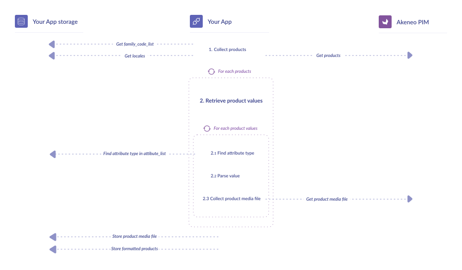

<a href="/tutorials/homepage.html" class="back-button">
   <button>
      
      All guided tutorials
   </button>
</a>

# How to get PIM product information

<table class="tag-container">
    <tr>
        <td>Use case:</td>
        <td>
            <div class="tag-not-selectable">
                <div class="tag-color tag-color-light-blue"></div>
                <div class="tag-label">App Workflow</div>
            </div>
        </td>
    </tr>
    <tr>
        <td>PIM Features:</td>
        <td class="td-features">
            <div class="tag-not-selectable">
                <div class="tag-color tag-color-yellow"></div>
                <div class="tag-label">Products</div>
            </div>
        </td>
    </tr>
</table>

<div class="endpoint-container">
    <div class="endpoint-text">REST API endpoint(s):</div>
    <a href="/api-reference.html#get_products_uuid" class="endpoint-link" target="_blank" rel="noopener noreferrer">products</a>
</div>

<div class="block-requirements">
    <div class="block-requirements-headline">
        If you're starting to build your App, make sure you previously followed:
    </div>
    <div class="block-requirements-row">
        
        <div class="block-requirements-steps">
            <div>Step 1. <a href="how-to-get-your-app-token.html" target="_blank" rel="noopener noreferrer">Get your App token tutorial</a></div>
            <div>Step 2. <a href="how-to-retrieve-pim-structure.html" target="_blank" rel="noopener noreferrer">How to retrieve PIM structure</a></div>
            <div>Step 3. <a href="how-to-get-families-and-attributes.html" target="_blank" rel="noopener noreferrer">How to get families and attributes</a></div>
        </div>
    </div>
</div>

## Context

The product resources hold all the information about your PIM product. Getting them will be done in two steps:
- Collect products by querying API and store basic information on them;
- Retrieve product values from the product payload


:::tips
Get the big picture <a href="/getting-started/synchronize-pim-products-6x/step-0.html" target="_blank" rel="noopener noreferrer">here</a>.
:::

### What is a product value?

Let’s stay simple with the following definition: a product value contains, for a given product, an attribute with its associated data for a given channel and locale.

By requesting one of the following API endpoints:

- [https://api.akeneo.com/api-reference.html#get_products](https://api.akeneo.com/api-reference.html#get_products)
- [https://api.akeneo.com/api-reference.html#get_products_uuid](https://api.akeneo.com/api-reference.html#get_products_uuid)

You will get a payload that contains, for each product, a list of its product values ( in `values` property).

Each entry of this property is an associative array (an array composed of key-value pairs)  with:

- An attribute code as the key;
- A list of objects as the value - let’s call it “AttributeValue”.

Each AttributeValue object contains a `data` field associated with a channel and a locale. If the attribute is select-option or multi-option, there is an extra `linked_data` property that contains option labels.

This `data` field is composed of the product information you want to extract. The format of this field depends on the attribute type.

In a nutshell:

<!-- todo find the right language for comments highlight -->
```

{
  "values": { # Contains all the product values, stored in associative arrays
	"an_attribute_code": [ # Key
	  { # AttributeValue object
	    "data": {...}, # the data you want to extract...
        "locale": "a_locale", # ... for a given locale...
        "scope": "a_channel" # ... and a channel.
      },
      { # AttributeValue object
	    "data": {...}, # the data you want to extract...
        "locale": "another_locale", # ... for a given locale...
        "scope": "another_channel", # ... and a channel.
        "linked_data": {
          "attribute": "attribute_code",
          "code": "an_option_code",
          "labels": {
	        "en_US": "option_code_label_for_locale_en_us",
            "fr_FR": "option_code_label_for_locale_fr_fr"
          }
        }
      },
	  ...
    ],
    "another_attribute_code": [...],
    ...
  }
}
```

## Workflow



## Fetch PIM products and parse values

### 0 - Initialization

```php [activate:PHP]

function buildApiClient(): GuzzleHttp\Client
{
	$pimUrl = 'https://url-of-your-pim.com';
    $appToken = 'your_app_token'; // Token provided during oAuth steps
    
    // If you haven't done it yet,
    // please follow the Guzzle official documentation to install the client 
    // https://docs.guzzlephp.org/en/stable/overview.html#installation

    // Set your client for querying Akeneo API as follows
    $client = new \GuzzleHttp\Client([
        'base_uri' => $pimUrl,
        'headers' => ['Authorization' => 'Bearer ' . $appToken],
    ]);
}
```
```javascript [activate:NodeJS]

// Install the node-fetch library by following the official documentation:
// https://www.npmjs.com/package/node-fetch
import fetch from 'node-fetch';

const pimUrl = 'https://url-of-your-pim.com';
const accessToken = 'your_app_token'; // Token provided during oAuth steps

// Set your client for querying Akeneo API as follows
async function get(url, accessToken) {
    return await fetch(url, {
        headers: {
            'Authorization': `Bearer ${accessToken}`
        }
    });
}
```

### 1 - Collect products

##### 1.1 - Start smart, start filtering

<!-- TODO check if this part was validated on notion -->

Getting your products could be long, very long! You may have a gigantic catalog with millions of entries: iterating over all of them - because of their among and because results of our API are paginated - may be a really bad experience…

So, it is primordial to filter as many as products you can right now with the help of our filters.

We recommend you the following product filters:

- by locale codes ;
- by channel code ;
- by enabled products (you probably don’t use not enabled products, don’t you?);
- with_attribute_options. When this option is activated, labels of attribute options will be returned in the response — and saves you from many extra API calls.

:::warning
Have a look at other [product filters](/documentation/filter.html#filter-on-product-properties.html): you may find other interesting ones.
:::

##### 1.2 - Get products

##### 1.2.1 - You are following the App workflow?

Collect only the products you need with the help of the family code list you built in the guided tutorial “How to get families, family variants, and attributes” and your locales and channel that you extracted during the guided tutorial “How to retrieve PIM structure”.

```php [activate:PHP]

function fetchProducts(): array
{
    $client = buildApiClient();

    // Get locales from storage
    $locales = getLocales(); // ['en_US', 'fr_FR']
    $scope = 'ecommerce';
    $maxProductsPerPage = 100;
    $maxFamiliesPerQuery = 10;
    $familyCodeChunks = array_chunk(getFamilyCodes(), $maxFamiliesPerQuery);

    $apiUrl = '/api/rest/v1/products-uuid'
        . '?with_attribute_options=true'
        . '&locales=%s'
        . '&scope=%s'
        . '&search={"enabled":[{"operator":"=","value":true}],'
        . '"family":[{"operator":"IN","value":%s}]}'
        . '&pagination_type=search_after'
        . '&limit=%s'
    ;

    $products = [];

    foreach ($familyCodeChunks as $familyCodes) {
        $nextUrl = sprintf(
            $apiUrl,
            implode(',', $locales),
            $scope,
            json_encode($familyCodes),
            $maxProductsPerPage
        );
        do {
            // Collect products from API
            $response = $client->get($nextUrl);
            $data = json_decode($response->getBody()->getContents(), true);
            $products[] = $data['_embedded']['items'];

            $nextUrl = $data['_links']['next']['href'] ?? null;
        } while (
            $nextUrl
        );
    }

    return array_merge(...$products);
}
```
```javascript [activate:NodeJS]

async function fetchProducts() {
    // Get locales from storage
    const locales = await getlocales();
    // Get family codes from storage
    const familyCodes = await getFamilyCodes(); // ['en_US', 'fr_FR']
    const scope = 'ecommerce'
    const maxItems = 100;
    const maxFamiliesPerQuery = 10;

    // split familyCodes in chucks of $maxFamiliesPerQuery elements
    const chunks = [];
    while (familyCodes.length > 0) {
        chunks.push(familyCodes.splice(0, maxFamiliesPerQuery));
    }

    const products = [];
    for (const chunk of chunks) {
        let nextUrl = `${pimUrl}/api/rest/v1/products-uuid`
            + `?with_attribute_options=true`
            + `&locales=${locales.join(',')}`
            + `&scope=${scope}`
            + `&search={"enabled":[{"operator":"=","value":true}],`
            + `"family":[{"operator":"IN","value":${JSON.stringify(chunk)}}]}`
            + `&pagination_type=search_after`
            + `&limit=${maxItems}`;

        do {
            const response = await get(nextUrl, accessToken);
            const data = await response.json();
            let newProducts = data['_embedded']['items'];
            products.push(...newProducts);

            nextUrl = data._links?.next?.href;
        } while (nextUrl)
    }

    return products;
}
```

##### 1.2.2. You aren't following the App workflow?

Call the product endpoint with these minimum filters.

```php [activate:PHP]

function fetchProducts(): array
{
    $client = buildApiClient();

    $maxProductsPerPage = 100;

    $nextUrl = sprintf(
        '/api/rest/v1/products-uuid'
        . '?with_attribute_options=true'
        . '&search={"enabled":[{"operator":"=","value":true}]}'
        . '&pagination_type=search_after'
        . '&limit=%s',
        $maxProductsPerPage
    );

    $products = [];
    do {
        // Collect products from API
        $response = $client->get($nextUrl);
        $data = json_decode($response->getBody()->getContents(), true);
        $products[] = $data['_embedded']['items'];

        $nextUrl = $data['_links']['next']['href'] ?? null;
    } while (
        $nextUrl
    );

    return array_merge(...$products);
}
```
```javascript [activate:NodeJS]

async function fetchProducts() {
  const maxItems = 100;

    let nextUrl = `${pimUrl}/api/rest/v1/products-uuid`
        + '?with_attribute_options=true'
        + '&search={"enabled":[{"operator":"=","value":true}]}'
        + '&pagination_type=search_after'
        + `&limit=${maxItems}`;

    const products = [];
    do {
        const response = await get(nextUrl, accessToken);
        const data = await response.json();
        let newProducts = data['_embedded']['items'];
        products.push(...newProducts);

        nextUrl = data._links?.next?.href;
    } while (nextUrl)

    return products;
}
```

### 2 - Retrieve product values

##### 2.1 - Get the attribute type

##### 2.1.1 - You are following the App workflow?

In the guided tutorial **How to get families and attribute**, we have stored an **attribute_list**, a list of tuples with attribute_code and attribute type. It’s time to use it.

Simply search your attribute in the **attribute_list**.

```php [activate:PHP]

function findAttributeTypeInAttributeList(string $attributeCode, array $attributeList): string
{
    return $attributeList[$attributeCode]['type'];
}
```

```javascript [activate:NodeJS]

function findAttributeTypeInAttributeList(attributeCode, attributeList) {
  const attribute = attributeList.filter(attribute => {
    if (attributeCode === attribute['code']) {
      return attribute;
    }
  });

  return attribute[0]['type'];
}
```

##### 2.1.2 - You haven't followed the App workflow?

Simply get the attribute type by requesting the API. Instructions [here](/tutorials/how-to-get-families-and-attributes.html#3-collect-attributes).

##### 2.2 - Parse value

Parse `data` properties according to the attribute type you got in the previous step.

```php [activate:PHP]

const PIM_CATALOG_IDENTIFIER = 'pim_catalog_identifier';
const PIM_CATALOG_TEXT = 'pim_catalog_text';
const PIM_CATALOG_TEXTAREA = 'pim_catalog_textarea';
const PIM_CATALOG_NUMBER = 'pim_catalog_number';
const PIM_CATALOG_BOOLEAN = 'pim_catalog_boolean';
const PIM_CATALOG_DATE = 'pim_catalog_date';
const PIM_CATALOG_PRICE_COLLECTION = 'pim_catalog_price_collection';
const PIM_CATALOG_SIMPLESELECT = 'pim_catalog_simpleselect';
const PIM_CATALOG_MULTISELECT = 'pim_catalog_multiselect';
const PIM_CATALOG_METRIC = 'pim_catalog_metric';

const PIM_CATALOG_FILE = 'pim_catalog_file';
const PIM_CATALOG_IMAGE = 'pim_catalog_image';

const FALLBACK_LOCALE = 'en_US';

function getFormattedProductValues(array $values, string $attributeType): array
{
    $data = [];

    foreach ($values as $value) {
        $locale = $value['locale'] ?? FALLBACK_LOCALE;
        $data['values'][$locale] = extractData($attributeType, $value);
        $data['type'] = $attributeType;
    }

    return $data;
}

function extractData(string $attributeType, array $value): string|bool
{
    switch ($attributeType) {
        case PIM_CATALOG_IDENTIFIER:
        case PIM_CATALOG_NUMBER:
        case PIM_CATALOG_TEXTAREA:
        case PIM_CATALOG_TEXT:
        case PIM_CATALOG_FILE:
        case PIM_CATALOG_IMAGE:
            return (string) $value['data'];

        case PIM_CATALOG_BOOLEAN:
            return (bool) $value['data'];

        case PIM_CATALOG_DATE:
            return (new \DateTime($value['data']))->format('m/d/Y');

        case PIM_CATALOG_PRICE_COLLECTION:
            $prices = \array_map(
                static fn(array $data) => \sprintf(
                    '%s %s',
                    $data['amount'],
                    $data['currency']
                ),
                $value['data'],
            );

            return \implode('; ', $prices);

        case PIM_CATALOG_SIMPLESELECT:
            $locale = $value['locale'] ?? FALLBACK_LOCALE;
            $data = $value['linked_data']['labels'][$locale];

            if ($data === null) {
                throw new \Exception(
                    sprintf(
                        'Option "%s" of Attribute "%s" has no translation for locale "%s".',
                        $value['linked_data']['code'],
                        $value['linked_data']['attribute'],
                        $locale
                    )
                );
            }

            return $data;

        case PIM_CATALOG_MULTISELECT:
            $locale = $value['locale'] ?? FALLBACK_LOCALE;

            $options = \array_map(
                static function ($linkedData) use ($locale) {
                    $data = $linkedData['labels'][$locale];

                    if ($data === null) {
                        throw new \Exception(
                            sprintf(
                                'Option "%s" of Attribute "%s" has no translation for locale "%s".',
                                $linkedData['code'],
                                $linkedData['attribute'],
                                $locale
                            )
                        );
                    }
                    return $data;
                },
                $value['linked_data'],
            );

            return \implode('; ', $options);

        case PIM_CATALOG_METRIC:
            return $value['data']['amount'] . ' ' . $value['data']['unit'];

        default:
            return is_scalar($value['data']) ?? $value['data'];
    }
}
```
```javascript [activate:NodeJS]

const PIM_CATALOG_IDENTIFIER = 'pim_catalog_identifier';
const PIM_CATALOG_TEXT = 'pim_catalog_text';
const PIM_CATALOG_TEXTAREA = 'pim_catalog_textarea';
const PIM_CATALOG_NUMBER = 'pim_catalog_number';
const PIM_CATALOG_BOOLEAN = 'pim_catalog_boolean';
const PIM_CATALOG_DATE = 'pim_catalog_date';
const PIM_CATALOG_PRICE_COLLECTION = 'pim_catalog_price_collection';
const PIM_CATALOG_SIMPLESELECT = 'pim_catalog_simpleselect';
const PIM_CATALOG_MULTISELECT = 'pim_catalog_multiselect';
const PIM_CATALOG_METRIC = 'pim_catalog_metric';

const PIM_CATALOG_FILE = 'pim_catalog_file';
const PIM_CATALOG_IMAGE = 'pim_catalog_image';

const FALLBACK_LOCALE = 'en_US';

function getFormattedProductValues(values, attributeType) {
  let data = {};
  for (const value of values) {
    let locale = value['locale'] ?? FALLBACK_LOCALE;
    data['values'] = {[locale]: extractData(attributeType, value)};
    data['type'] = attributeType;
  }

  return data;
}

function extractData(attributeType, value) {
  let locale;
  switch (attributeType) {
    case PIM_CATALOG_IDENTIFIER:
    case PIM_CATALOG_NUMBER:
    case PIM_CATALOG_TEXTAREA:
    case PIM_CATALOG_TEXT:
    case PIM_CATALOG_FILE:
    case PIM_CATALOG_IMAGE:
      return value['data'].toString();

    case PIM_CATALOG_BOOLEAN:
      return !value['data'];

    case PIM_CATALOG_DATE:
      return new Date(value['data']).toLocaleDateString('en-US');

    case PIM_CATALOG_PRICE_COLLECTION:
      const prices = value['data'].map((data) => data['amount'] + ' ' + data['currency']);
      return prices.join('; ');

    case PIM_CATALOG_SIMPLESELECT:
      locale = value['locale'] ?? FALLBACK_LOCALE;
      const data = value['linked_data']['labels'][locale];

      if (data === null) {
        throw new Error(
            `Option ${value['linked_data']['code']} of Attribute ${value['linked_data']['attribute']} has no translation for locale ${locale}.`,
        );
      }

      return data;

    case PIM_CATALOG_MULTISELECT:
      locale = value['locale'] ?? FALLBACK_LOCALE;
      const options = Object.entries(value['linked_data']).map((linkedDatas) => {
        Object.entries(linkedDatas).map((linkedData) => {
          if (linkedData.hasOwnProperty('labels')) {
            const data = linkedData['labels'][locale];

            if (data === null) {
              throw new Error(
                  `Option ${linkedData['code']} of Attribute ${linkedData['attribute']} has no translation for ${locale}.`
              );
            }
            return data;
          }
        });
      });

      return options.join('; ');

    case PIM_CATALOG_METRIC:
      return value['data']['amount'] + ' ' + value['data']['unit'];

    default:
      if (typeof value['data'] !== 'object' && value['data'] !== null && !Array.isArray(value['data'])) {
        return true;
      }
      return value['data'];
  }
}
```

Iterate over products to parse their value list one by one:
```php [activate:PHP]

$products = fetchProducts();
$attributes = getAttributes();

foreach ($products as $key => $product) {
    $formattedValuesList = [];

    foreach ($product['values'] as $attributeCode => $values) {
        $attributeType = findAttributeTypeInAttributeList($attributeCode, $attributes);
        $formattedValues = getFormattedProductValues($values, $attributeType);

        $formattedValuesList[$attributeCode] = $formattedValues;
    }
    $products[$key]['values'] = $formattedValuesList;
}

storeProducts($products);
```

```javascript [activate:NodeJS]

const products = await fetchProducts();
const attributes = await getAttributes();

for (const [key, product] of Object.entries(products)) {
  let formattedValuesList = {};
  for (const [attributeCode, value] of Object.entries(product.values)) {
    const type = findAttributeTypeInAttributeList(attributeCode, attributes);
    const formattedValues = getFormattedProductValues(value, type);
    
    formattedValuesList[attributeCode] = formattedValues;
  }

  products[key] = {...products[key], values: {...formattedValuesList}};
}

storeProducts(products);
```

Example output:
```php [activate:PHP]

var_export($products);

// Output
[
    [
        'uuid' => '002acc58-c751-4f91-b614-18b029194d06',
        'enabled' => true,
        'family' => 'it',
        'categories' => [],
        'groups' => [],
        'parent' => null,
        'values' => [
            'name' => [
                'values' => [
                    'en_US' => 'printer',
                    'fr_FR' => 'imprimante',
                ],
                'type' => 'pim_catalog_text',
            ],
            'description' => [
                'values' => [
                    'en_US' => '<p>Description of the product</p>',
                    'fr_FR' => '<p>Description du produit</p>',
                ],
                'type' => 'pim_catalog_textarea',
            ],
        ],
        'created' => '2022-11-03T16:26:06+00:00',
        'updated' => '2022-11-03T16:26:07+00:00',
        'associations' => [],
        'quantified_associations' => [],
        'metadata' => [],
    ],
    /* ... */
]
```
```javascript [activate:NodeJS]

console.log(products);

// Output
[
    {
        "uuid": "002acc58-c751-4f91-b614-18b029194d06",
        "enabled": true,
        "family": "it",
        "categories": [],
        "groups": [],
        "parent": null,
        "values":
        {
            "name":
            {
                "values":
                {
                    "en_US": "printer",
                    "fr_FR": "imprimante"
                },
                "type": "pim_catalog_text"
            },
            "description":
            {
                "values":
                {
                    "en_US": "<p>Description of the product</p>",
                    "fr_FR": "<p>Description du produit</p>"
                },
                "type": "pim_catalog_textarea"
            }
        },
        "created": "2022-11-03T16:26:06+00:00",
        "updated": "2022-11-03T16:26:07+00:00",
        "associations": [],
        "quantified_associations": [],
        "metadata": []
    }
]
```
:::warning
Disclaimer: The previous snippet doesn’t handle for now the following attribute types:

- Asset collection attribute
- Reference entity simple link attribute
- Reference entity multiple links attribute
- Reference data simple select attribute
- Reference data multi select attribute
- Table attribute
:::

###### 2.3 - Collect product media files

Is your attribute type **pim_catalog_file** or **pim_catalog_image** ?
It means you are looking at media that can be downloaded. To proceed, simply call the “product media file” API endpoint.

```php [activate:PHP]

function fetchProductMediaFileResources(array $productMediaFileValues): array
{
    $client = buildApiClient();

    $productMediaFileResources = [];

    foreach ($productMediaFileValues as $locale => $value) {
        $pimUrl = '/api/rest/v1/media-files/' . $value;

        $response = $client->get($pimUrl);
        $data = json_decode($response->getBody()->getContents(), true);

        $productMediaFileResources[$locale] = $data;
    }

    return $productMediaFileResources;
}
```

```javascript [activate:NodeJS]

async function fetchProductMediaFileResources(productMediaFileValues) {
    let productMedias = {};
    for (const [locale, value] of Object.entries(productMediaFileValues)) {
        const apiUrl = pimUrl + '/api/rest/v1/media-files/' + value;
        const response = await get(apiUrl, accessToken);
        const data = await response.json();
        productMedias = {[locale]: data};
    }

    return productMedias;
}
```

Update the previous script from step 2.2 so media files are fetched in the same loop:
```php [activate:PHP]

$products = fetchProducts();
$attributes = getAttributes();

$productMediaFileResources = [];

foreach ($products as $key => $product) {
    $formattedValuesList = [];

    foreach ($product['values'] as $attributeCode => $values) {
        $attributeType = findAttributeTypeInAttributeList($attributeCode, $attributes);
        $formattedValues = getFormattedProductValues($values, $attributeType);

        if (in_array($attributeType, [PIM_CATALOG_IMAGE, PIM_CATALOG_FILE], true)) {
            $productMediaFileResources[$product['uuid']][$attributeCode]
                = fetchProductMediaFileResources($formattedValues['values']);
        }

        $formattedValuesList[$attributeCode] = $formattedValues;
    }
    $products[$key]['values'] = $formattedValuesList;
}

// Save product and media files into storage
storeProducts($products);
storeMediaFiles($productMediaFileResources);
```
```javascript [activate:NodeJS]

    const products = await fetchProducts();
    const attributes = await getAttributes();

    let productMediaFileResources = {};
    for (const [key, product] of Object.entries(products)) {
      let formattedValuesList = {};
      for (const [attributeCode, value] of Object.entries(product.values)) {
        const type = findAttributeTypeInAttributeList(attributeCode, attributes);
        const formattedValues = getFormattedProductValues(value, type);

        if ([PIM_CATALOG_IMAGE, PIM_CATALOG_FILE].includes(type)) {
          let productMedia = await fetchProductMediaFileResources(formattedValues['values']);
          productMediaFileResources[product['uuid']] = {[attributeCode]: productMedia};
        }

        formattedValuesList[attributeCode] = formattedValues;
      }

      products[key] = {...products[key], values: {...formattedValuesList}};
    }

    // Save product and media files into storage
    storeProducts(products);
    storeMediaFiles(productMediaFileResources);
```

Example output:
```php [activate:PHP]

var_export($productMediaFileResources);

// Output
[
    [
        '016f042a-4357-43d6-89aa-d62e1dd7fa6f' => [
            'picture' => [
                'en_US' => [
                    'code' => 'b/5/0/c/b50cc5ee7ae06333e10d1796bc92cf6b7bacbf44_13387800_840.jpg',
                    'original_filename' => '13387800-840.jpg',
                    'mime_type' => 'image/jpeg',
                    'size' => 14704,
                    'extension' => 'jpg',
                ]
            ]
        ]
    ],
    /* ... */
]
```
```javascript [activate:NodeJS]

console.log(productMediaFileResources);

// Output
[
    {
        "016f042a-4357-43d6-89aa-d62e1dd7fa6f":
        {
            "picture":
            {
                "en_US":
                {
                    "code": "b/5/0/c/b50cc5ee7ae06333e10d1796bc92cf6b7bacbf44_13387800_840.jpg",
                    "original_filename": "13387800-840.jpg",
                    "mime_type": "image/jpeg",
                    "size": 14704,
                    "extension": "jpg"
                }
            }
        }
    }
]
```

:::info
Keep in mind that synchronizing media files might be time and resource-consuming. Download media only if you need it, or do it in a dedicated and independent process.
:::

<div class="block-next-steps block-next-steps-alt">
    
    <div class="block-next-steps-column">
        <div class="block-next-steps-title">Next Step</div>
        <div class="block-next-steps-text">Well done! Keep digging into the “App workflow” and follow the next tutorial!</div>
        <div>
            <ul>
                <li><a href="/tutorials/how-to-collect-product-variations.html">How to collect product variations</a></li>
            </ul>
        </div>
    </div>
</div>