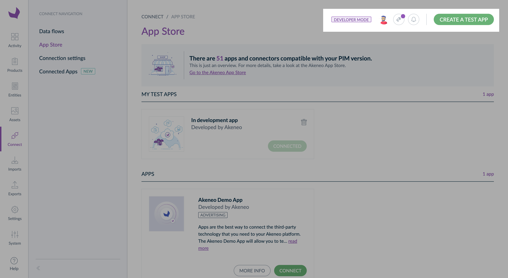
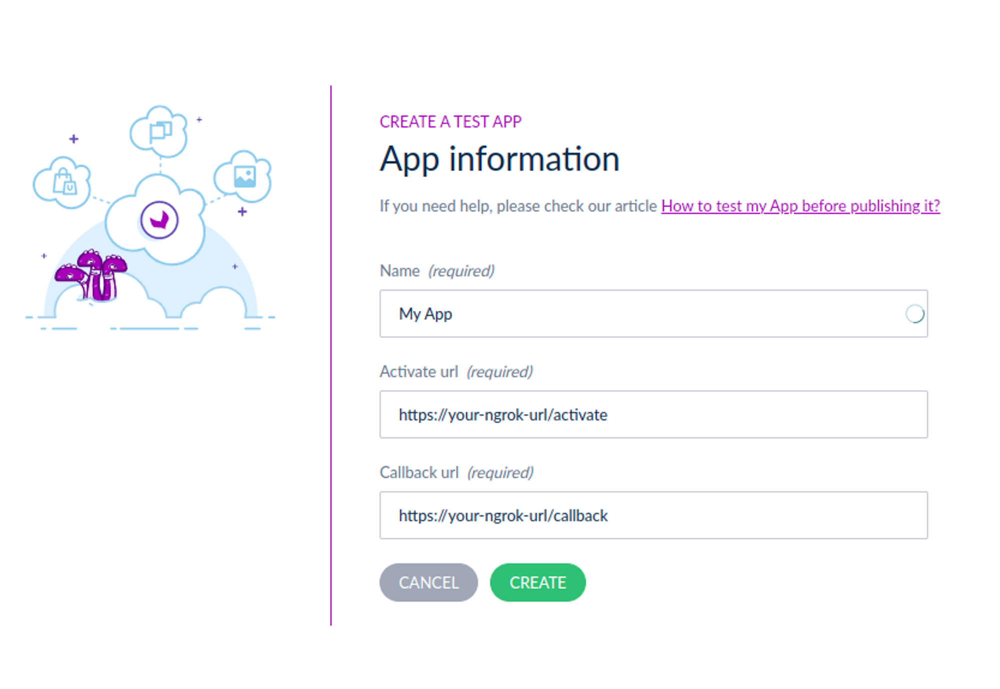
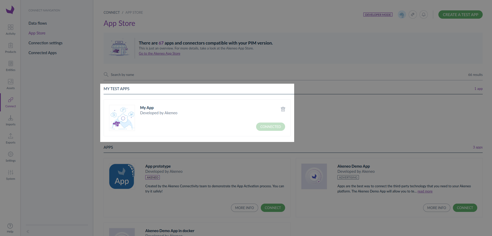

<a href="/tutorials/homepage.html" class="back-button">
   <button>
      
      All guided tutorials
   </button>
</a>

# Get your App token

Implement the required parts of the App activation process and receive an App access token for querying your PIM API.

<table class="tag-container-xs">
    <tr>
        <td>Use case:</td>
        <td>
            <div class="tag-not-selectable">
                <div class="tag-color tag-color-light-blue"></div>
                <div class="tag-label">App Workflow</div>
            </div>
        </td>
    </tr>
</table>

<div class="block-welcome">
    <div class="block-welcome-title">Welcome!</div>
    <div class="block-welcome-row">
        <div class="block-welcome-text">
            This section will follow you all along the technical tutorials
            marked with the use case <b>"App workflow"</b>.
        </div>
        
    </div>
    <div class="block-welcome-text">
         The App workflow starts with this <b>quick start</b> tutorial that will walk you
         through creating a draft App and receiving a permanent <b>access token to call the REST API.</b>
    </div>
    <div class="block-welcome-text">
        <b>Let's start!</b>
    </div>
</div>

## What you will learn
At the end of this tutorial, you will have bootstrapped an App, received a permanent App access token to your PIM,
and be ready for your very first API call with your brand-new token.

::: info
If you feel that you need to dig a bit more into the Authentication process, start reading our
[dedicated guide](/apps/authentication-and-authorization.html#oauth-20). By following it you won’t have
code snippets but a lot of guidance to implement the whole process.
:::

## Requirements

- You’ve got a PIM developer sandbox. If not, please [contact us](https://www.akeneo.com/contact/)

## Option 1: Get our Start App

Do you want to quickly start developing? Good news: we have created Start Apps for that purpose!
(Pick up your favorite technology and follow the guide). [link to sample Apps]

## Option 2: Build your App with our snippets below

In this section, we explain to you how to build your own App and provide you with snippets.

### Step 1: Expose your activation and callback URLs

First, your application must expose an **activation URL**.

In our example, we won't do additional steps (like authentication), so we will launch the Authorization Request immediately in this Activation URL.

!!!include(content/apps/create-app/activate-php.md)!!!
!!!include(content/apps/create-app/activate-nodejs.md)!!!
!!!include(content/apps/create-app/activate-python.md)!!!
!!!include(content/apps/create-app/activate-java.md)!!!

Then, your application must expose a **callback URL**.

!!!include(content/apps/create-app/callback-php.md)!!!
!!!include(content/apps/create-app/callback-nodejs.md)!!!
!!!include(content/apps/create-app/callback-python.md)!!!
!!!include(content/apps/create-app/callback-java.md)!!!


::: info
You can find more information about the authorization process and code challenge in the following documentation. 
- [OAuth Authorization and authentication](/apps/authentication-and-authorization.html#)
:::

### Step 2: Create a tunnel to expose your local App

::: info
if you use a local version of PIM, skip this step
:::

Use ngrok to create a tunnel that allows your App to be accessed using a unique HTTPS URL.
You need to [create an ngrok account](https://ngrok.com/) and [auth token](https://dashboard.ngrok.com/auth/your-authtoken) to preview your App.

```shell

ngrok http 8000
```

If everything goes well the command will output your public URL for your local App:


### Step 3: Declare your local App as a test App in your sandbox to generate credentials

To get credentials for your app, you need to create a test App on your developer sandbox.

First of all, go to `Connect`, then `App Store`

#### Permissions

If you see `Create a test App` skip to [Connect app](#connect-app), else please enable the `developer mode`.


To do so, you need to:
1. Go to `System`, then `Roles`
2. Choose the role you use for your user
3. In the `Permissions` tab, scroll down and search for the `Developer mode` submenu
4. Select `Manage test apps`
5. Don't forget to save your modifications

#### Connect app

To create a test App:
1. In the top right corner, click on `Create a test App`
2. Fill in all the required information<br />
   &rarr; Paste your callback & activation URLs<br />
   &nbsp;&nbsp;&nbsp;&nbsp;&nbsp;&nbsp;&nbsp;&nbsp;Activate URL: [your-ngrok-url]/activate<br />
   &nbsp;&nbsp;&nbsp;&nbsp;&nbsp;&nbsp;&nbsp;&nbsp;Callback: [your-ngrok-url]/callback
      
3. Then click on `Create`
4. Copy/paste credentials in your app configuration file
   
5. And click on `Done`
6. Your test App appears on the App Store page


### Step 4: Run your local App


Connecting a test App is like connecting a published App. 

1. Launch your APP
2. Click on `Connect`
3. Your App opens in a new tab of your browser
4. Launch the connection process from your App
5. Follow all the activation process steps, then `Confirm`
6. Your test App is now connected with Akeneo PIM! 🔗

Now that your App is connected, you can enjoy all the available App features from the Akeneo PXM Studio UI and test that your App works well. 

To access the settings of your connected App on Akeneo PIM, please go to `Connected Apps`, then click on `Manage App`. 
You can also open your App from Akeneo PIM UI, to do so, click on `Open app`. 



::: info
To know more about the step-by-step activation process, please read our article:  
[How to connect an App?](https://help.akeneo.com/pim/serenity/articles/how-to-connect-my-pim-with-apps.html#how-to-connect-an-app)
:::

### Step 5: Use your access token to call the API

At the end of this process, you receive the following response with an `access_token`:
var_export
```json

{
  "access_token": "Y2YyYjM1ZjMyMmZlZmE5Yzg0OTNiYjRjvar_exportZTJjNjk0ZTUxYTE0NWI5Zm",
  "token_type": "bearer",
  "scope": "read_products write_products"
}
```

You can use this token to call the Akeneo PIM REST API.

<div class="block-next-steps block-next-steps-main">
    <div class="block-next-steps-title">Next Step</div>
    <div class="block-next-steps-text">Now that you’ve gotten your App token, continue the journey with Step 2!</div>
    <a href="/tutorials/how-to-retrieve-pim-structure.html" class="next-steps-button next-steps-button-smaller">
        <div class="next-steps-button-number">2</div>
        <div class="next-steps-button-text">
            Develop<br>
            your App
        </div>
   </a>
</div>
