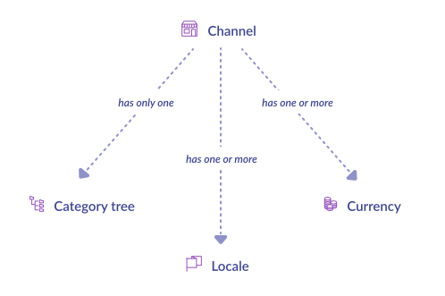
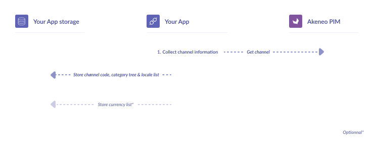

<a href="/tutorials/homepage.html" class="back-button">
   <button>
      
      All guided tutorials
   </button>
</a>

# How to retrieve PIM structure

Retrieve the PIM structure through a channel resource. This is usually the required step before starting to read the PIM catalog data.

<table class="tag-container">
    <tr>
        <td>Use case:</td>
        <td>
            <div class="tag-not-selectable">
                <div class="tag-color tag-color-light-blue"></div>
                <div class="tag-label">App Workflow</div>
            </div>
        </td>
    </tr>
    <tr>
        <td>PIM Features:</td>
        <td>
            <div class="tag-not-selectable">
                <div class="tag-color tag-color-red"></div>
                <div class="tag-label">Channel</div>
            </div>
        </td>
    </tr>
</table>

<div class="endpoint-container">
    <div class="endpoint-text">REST API endpoint(s):</div>
    <a href="/api-reference.html#Channel" class="endpoint-link" target="_blank" rel="noopener noreferrer">channel</a>
</div>

<div class="block-requirements">
    <div class="block-requirements-headline">
        If you're starting building your App, make sure you previously followed:
    </div>
    <div class="block-requirements-row">
        
        <div class="block-requirements-steps">
            <ul>
                <li>Step 1. <a href="how-to-get-your-app-token.html" target="_blank" rel="noopener noreferrer">Get your App token tutorial</a></li>
            </ul>
        </div>
    </div>
</div>


## Context

The channel resource holds the basic PIM structure data.



:::tips
Get the big picture <a href="/getting-started/synchronize-pim-products-6x/step-0.html" target="_blank" rel="noopener noreferrer">here</a>.
:::

## Fetch the PIM structure

### 0. Initialization

```php [activate:PHP]

$pimUrl = 'https://url-of-your-pim.com';
$appToken = 'your_app_token'; // Token provided during oAuth steps

// If you haven't done it yet, please follow the Guzzle official documentation for installing the client 
// https://docs.guzzlephp.org/en/stable/overview.html#installation

// Set your client for querying Akeneo API as follows
$client = new \GuzzleHttp\Client([
    'base_uri' => $pimUrl,
    'headers' => ['Authorization' => 'Bearer ' . $appToken],
]);
```

```javascript [activate:NodeJS]

// Install the node-fetch library by following the official documentation:
// https://www.npmjs.com/package/node-fetch

import fetch from 'node-fetch';
```

### 1. Get the PIM structure by fetching a channel from API

Workflow



Collect channel from PIM API:

```php [activate:PHP]

const API_URL = '/api/rest/v1/channels/%s';

// Your own channel
$channelCode = 'ecommerce';

// Make an authenticated call to the API
$response = $client->get(
	sprintf(API_URL, $channelCode)
);

// Convert json response to array
$channel = json_decode($response->getBody()->getContents(), true);
```

```javascript [activate:NodeJS]

import fetch from 'node-fetch';

const pimUrl = 'https://url-of-your-pim.com';
const accessToken = 'your_app_token'; // Token provided during oAuth steps

const channelCode = 'ecommerce';

const response = await fetch(`${pimUrl}/api/rest/v1/channels/${channelCode}`, {
  headers: {
    'Authorization': `Bearer ${accessToken}`
  }
});

const channel = await response.json();
```

The retrieved channel resource looks like this:

```php [activate:PHP]

var_export($channel);

// Output
[
    'code' => 'ecommerce',
    'currencies' => [
        'USD',
        'EUR',
    ],
    'locales' => [
        'de_DE',
        'en_US',
        'fr_FR',
    ],
    'category_tree' => 'master',
    'conversion_units' => [],
    'labels' => [
        'en_US' => 'Ecommerce',
        'de_DE' => 'Ecommerce',
        'fr_FR' => 'Ecommerce',
    ],
]
```

```javascript [activate:NodeJS]

console.log(channel);

// Output
{
    code: 'ecommerce',
    currencies: [
        'USD',
        'EUR'
    ],
    locales: [
        'de_DE',
        'en_US',
        'fr_FR'
    ],
    category_tree: 'master',
    conversion_units: {},
    labels: {
        en_US: 'Ecommerce',
        de_DE: 'Ecommerce',
        fr_FR: 'Ecommerce'
    }
}
````

### 2. Store the PIM structure

We advise storing in your App locales, currencies, and root category.
- Locales will allow filtering many localizable resource labels, and parsing product attribute values,
- Currencies will be used to parse product values price attribute type,
- Root category property will allow retrieving the whole category tree linked to the channel.

```php [activate:PHP]

storeCurrencies($channel['currencies']);
storeLocales($channel['locales']);
storeCategoryTree($channel['category_tree']);
```

```javascript [activate:NodeJS]

storeCurrencies(channel.currencies);
storeLocales(channel.locales);
storeCategoryTree(channel.category_tree);
```

<div class="block-next-steps block-next-steps-alt">
    
    <div class="block-next-steps-column">
        <div class="block-next-steps-title">Next Step</div>
        <div class="block-next-steps-text">Well done! Keep digging into the “App workflow” and follow the next tutorial!</div>
        <div>
            <ul>
                <li><a href="/tutorials/how-to-get-families-and-attributes.html">How to get families and attributes</a></li>
            </ul>
        </div>
    </div>
</div>
