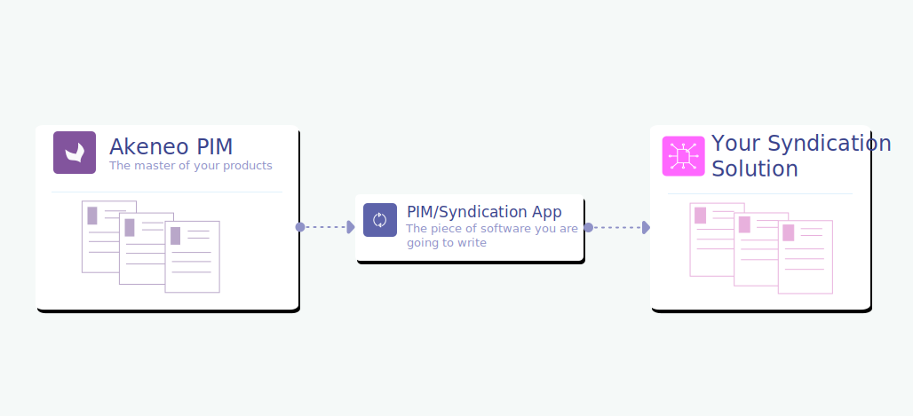
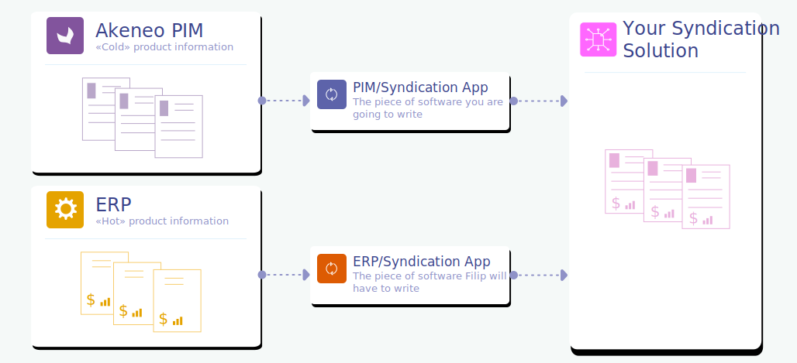
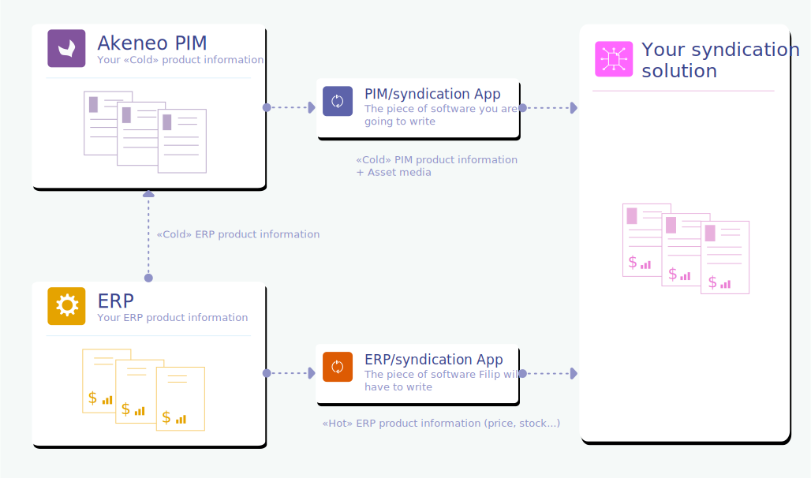

# Who does what?

## Macro overview

Akeneo PIM provides a single place to collect, manage, and enrich product information, create a product catalog, and distribute it to the syndication solution.

In the context of a "PIM/syndication" architecture, the **PIM becomes the Reference of marketing product information**.

## Akeneo PIM and ERP solution...

As seen previously, Akeneo PIM is therefore the source for product information... but what data are we talking about?

### Does Akeneo PIM have all product information needed for the syndication solution?

The answer is NO (most of the time) because Akeneo PIM should only manage **"cold" product information**. It means that Akeneo PIM only owns marketing product information that needs to be checked, organized, enriched. And “cold” product information means that this information does not change every day.

Concerning **“hot product information”** (i.e. product information that changes frequently: prices or stock), this information should be directly transmitted to the syndication solution without passing through Akeneo PIM. **“Hot product information”** flow should go directly from the ERP to the syndication solution (It’s the ERP's responsibility to deliver this information. Again: a PIM only manages “cold” Marketing product information).

::: info
For example, **up-to-date price and stock information** of a product should never be stored in Akeneo PIM and should be transmitted directly from the ERP into the syndication solution.
:::

For price information, Akeneo PIM has the capability of storing product price information, but only for a **“reference”** price and not an **“up-to-date”** price. This **“reference” price** is for information purposes only for the teams managing Akeneo PIM (Julia) and should never be mapped to the syndication solution price displayed in marketplaces.

:::info
* The **PIM** should only own **“cold”** product information.
* **ERPs** own **“hot”** product information (like prices and stocks).
* PIM product price information shouldn't be mapped to syndication solution price, but you can have a specific App configuration that enables/disables this setting to allow or not this mapping (In the context of some projects, we met some clients who were forced to pass pricing information through the PIM).
:::

## Akeneo PIM and DAM

Akeneo PIM manages product-related media.

Since the 4.0 version , Akeneo also facilitates the connection with a DAM software thanks to its [new asset management system](/concepts/asset-manager.html).

:::tips
If you want to know how a DAM connection works, don't hesitate to read our [dedicated documentation](../dam-connection/introduction.html).
:::

There are different 2 ways to manage media with the PIM:

* **Akeneo PIM without a DAM**

Akeneo PIM manages product media internally (with some specific media attributes or its asset manager). Media binaries are then stored directly into the PIM.

* **Akeneo PIM with a DAM**

The DAM solution transfers its data to the PIM (media asset URL and its metadata) and the PIM is then responsible for linking products to media assets.

Instead of binaries stored in the PIM method, the use of media URLs (and therefore the use of a DAM/CDN in addition to a PIM is undoubtedly the best solution to manage product images and allow them to be transferred into the syndication solution in a smooth and optimized way as URL information.

::: info  
2 possible configurations to manage media with the PIM:
* Akeneo PIM alone: the PIM manages media **as binaries**,
* Akeneo PIM associated to a DAM/CDN: the PIM manages media **as URLs** (this is the recommended method for performance reasons).
:::

## Conclusions

In conclusion, in relation to what has been said above, it is, therefore, necessary to consider the following possible architectures which may lead to completely different PIM catalog models:

### Architecture ERP / PIM / Syndication solution

### Architecture ERP / DAM / PIM / Syndication solution

Of course these are only basic PIM architectures: some clients may have multiple data sources or destinations making the data workflow managed by your App more complex… However, for asset media management, we suggest that you focus on these 2 typical architectures that we believe are the most used by our clients.

::: warning
A syndication App never works alone: a syndication solution needs a **PIM App** and probably an **ERP App** in order to have all the product information enabling products to be activated and therefore visible in marketplaces...
:::   
